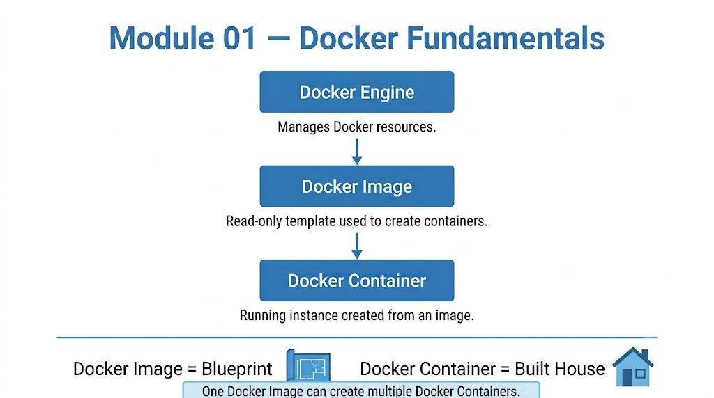
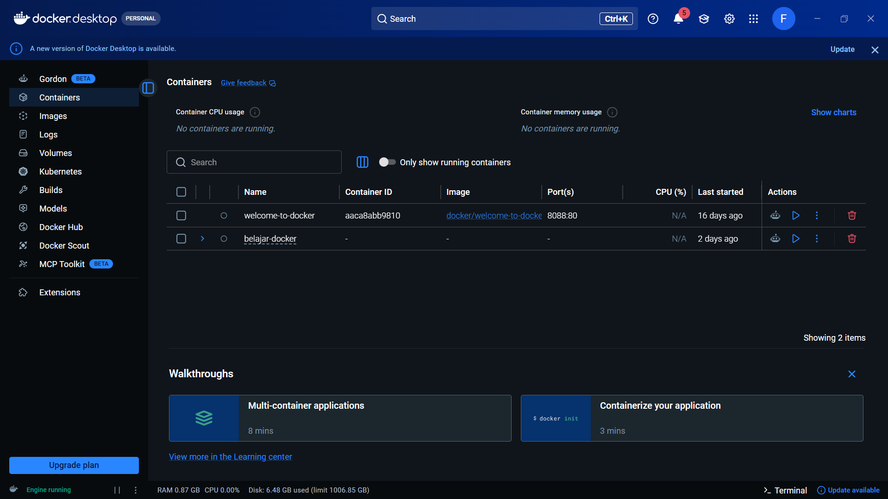
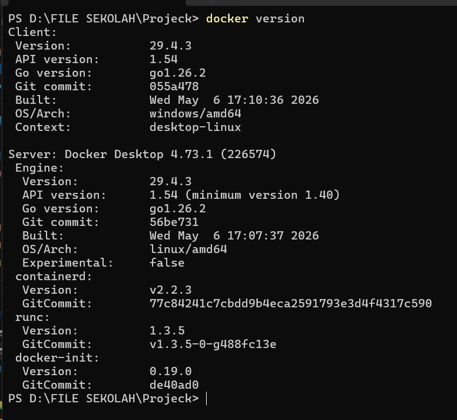
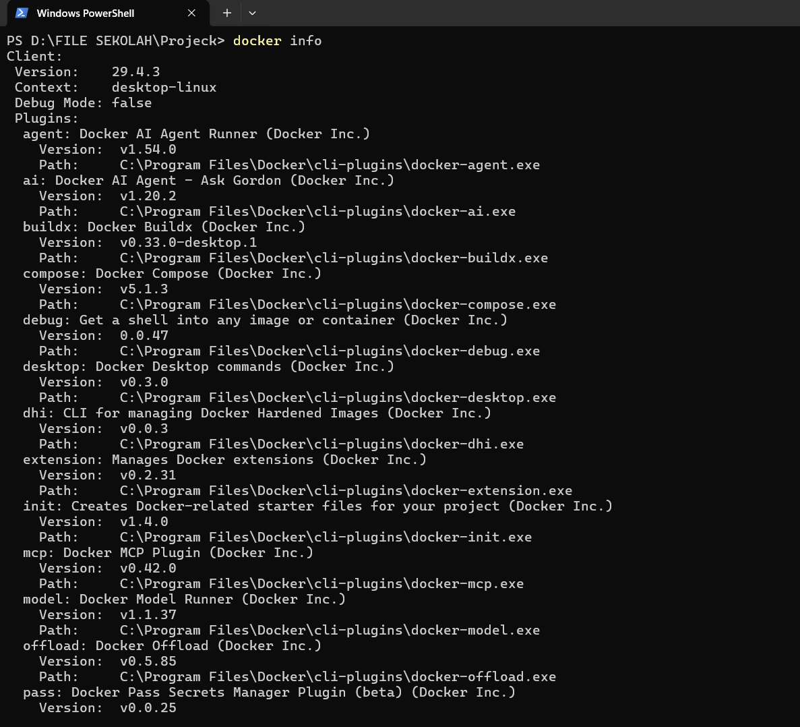

# Docker Fundamentals

**Learning Date:** June 23, 2026

---

# Overview

Docker merupakan teknologi containerization yang memungkinkan aplikasi berjalan secara konsisten di berbagai lingkungan tanpa harus khawatir dengan perbedaan sistem operasi atau dependency.

Pada modul pertama ini saya mempelajari konsep dasar Docker sebagai pondasi sebelum masuk ke Docker Compose, Kubernetes, maupun teknologi Cloud lainnya.

---

# Learning Objectives

Setelah menyelesaikan modul ini saya mampu memahami:

- Apa itu Docker.
- Apa itu Docker Engine.
- Perbedaan Docker Image dan Docker Container.
- Hubungan antara Docker Engine, Image, dan Container.
- Alur dasar bagaimana Docker bekerja.

---

# Topics Covered

- Docker
- Docker Engine
- Docker Image
- Docker Container
- Image vs Container

---

# Core Concepts

## Docker

Docker adalah platform containerization yang digunakan untuk menjalankan aplikasi beserta seluruh dependency-nya di dalam sebuah container.

Dengan Docker, aplikasi dapat dijalankan secara konsisten di berbagai lingkungan tanpa perlu melakukan konfigurasi ulang.

---

## Docker Engine

Docker Engine merupakan komponen utama yang bertugas membangun, menjalankan, dan mengelola seluruh resource Docker seperti Image, Container, Network, dan Volume.

Docker Engine menjadi "otak" dari seluruh proses yang terjadi di Docker.

---

## Docker Image

Docker Image adalah template yang berisi seluruh kebutuhan aplikasi.

Image bersifat read-only dan dapat digunakan berkali-kali untuk membuat Container.

---

## Docker Container

Container merupakan hasil dari Docker Image yang sedang berjalan.

Satu Docker Image dapat digunakan untuk membuat banyak Container.

---

## Image vs Container

Analogi sederhana yang saya gunakan selama belajar:

```
Docker Image
      ↓
Blueprint Rumah

Docker Container
      ↓
Rumah yang sudah dibangun
```

Satu blueprint dapat digunakan untuk membangun banyak rumah.

Begitu juga satu Image dapat membuat banyak Container.

---

## Concept Diagram

Diagram berikut menggambarkan hubungan antara Docker Engine, Docker Image, dan Docker Container.

<p align="center">
  
</p>

# Docker Workflow

```
Docker Engine
        │
        ▼
Docker Image
        │
        ▼
Docker Container
```

---

# Hands-on Practice
Selama modul ini, saya melakukan beberapa praktik dasar untuk memastikan Docker berhasil terinstal dan berjalan dengan baik.

Pada modul ini saya melakukan beberapa praktik dasar:

- Menginstall Docker Desktop.
- Menjalankan Docker Engine.
- Memahami tampilan Docker Desktop.
- Mempelajari hubungan antara Image dan Container.

### 1. Docker Desktop

Docker Desktop berhasil dijalankan sebagai lingkungan utama untuk mengelola Docker Engine di Windows.

<p align="center">
  
</p>
### 2. Verifikasi Instalasi Docker

Perintah `docker version` digunakan untuk memastikan Docker CLI dan Docker Engine telah terinstal dan dapat berkomunikasi dengan baik.

```bash
docker version
```

<p align="center">
  
</p>

### 3. Melihat Informasi Docker Engine

Perintah `docker info` digunakan untuk menampilkan informasi lengkap mengenai Docker Engine yang sedang berjalan, seperti jumlah container, image, driver penyimpanan, serta konfigurasi host.

```bash
docker info
```

<p align="center">
  
</p>

---

# Key Takeaways

- Docker Engine merupakan pusat dari seluruh layanan Docker.
- Docker Image adalah template.
- Docker Container adalah instance dari Image.
- Satu Image dapat membuat banyak Container.

---

# Personal Insights

Pada awal belajar saya sempat menganggap bahwa Docker Image adalah aplikasi yang langsung dijalankan.

Setelah mempelajari konsep Docker, saya memahami bahwa Image hanyalah template.

Container-lah yang benar-benar berjalan sebagai aplikasi.

Analogi Blueprint → Rumah sangat membantu saya memahami konsep ini.

---

# References

- Docker Official Documentation
- Catatan pembelajaran pribadi

---

Maintained by **Fendy Ramadhani**

GitHub: https://github.com/fendyramadhani9-cloud

LinkedIn: https://www.linkedin.com/in/fendy-ramadhani9

Email: fendyramadhani9@gmail.com
