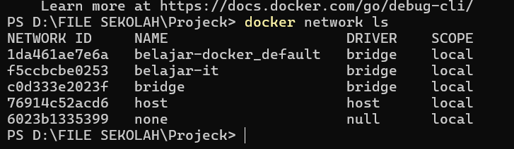
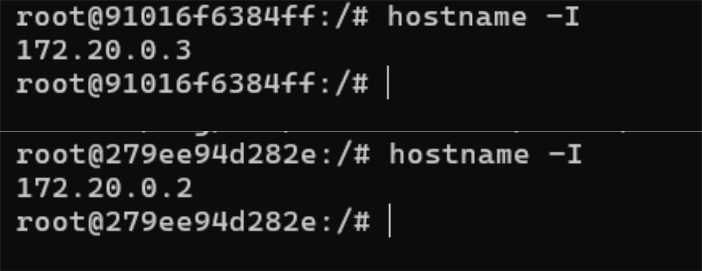

# Docker Network

## 1. Docker Network

Pernah kepikiran nggak, gimana caranya satu container bisa saling berkomunikasi dengan container lain?

Nah, di sinilah fungsi **Docker Network**. Docker Network digunakan untuk mengatur bagaimana container saling terhubung, baik dengan container lain maupun dengan host (komputer kita).

Tanpa adanya network, setiap container akan berjalan sendiri-sendiri sehingga tidak bisa saling bertukar data.

## Analogi

Analogi yang paling membantu saya saat belajar adalah **grup WhatsApp**.

Bayangkan setiap container adalah satu orang.

Kalau mereka belum berada di grup WhatsApp yang sama, mereka tidak bisa saling mengenal ataupun berkomunikasi.

Docker Network bisa diibaratkan sebagai grup WhatsApp tersebut. Selama container berada di network yang sama, mereka bisa saling berkomunikasi. Bahkan nantinya mereka juga bisa saling memanggil menggunakan **nama container**, tanpa harus mengingat alamat IP masing-masing.
## 2. Bridge Network

Saat Docker pertama kali diinstal, Docker akan otomatis membuat sebuah network bernama **bridge**.

Jika kita membuat container tanpa menentukan network sendiri, Docker akan langsung menghubungkannya ke **Bridge Network**.

Bridge Network cocok digunakan ketika beberapa container ingin saling berkomunikasi di dalam satu host yang sama.

## Analogi

Saat belajar, saya menganggap **Bridge Network** seperti **komplek perumahan**.

Setiap rumah yang berada di dalam komplek yang sama dapat saling mengunjungi karena berada di lingkungan yang sama.

Begitu juga dengan container. Selama berada di Bridge Network yang sama, container dapat saling berkomunikasi tanpa perlu membuat network baru.

```bash
docker network ls
```

### Penjelasan Parameter

| Parameter | Fungsi |
|-----------|--------|
| `docker network` | Digunakan untuk mengelola Docker Network. |
| `ls` | Menampilkan daftar network yang tersedia. |

### Logic

Saat Docker diinstal, Bridge Network sudah dibuat secara otomatis.

Setiap container yang dibuat tanpa menentukan network akan langsung bergabung ke Bridge Network tersebut.

### Hasil Praktik

<p align="center">
  
</p>

### Kesimpulan

- Docker memiliki network bawaan bernama **bridge**.
- Container akan otomatis menggunakan Bridge Network jika tidak ditentukan network lain.
- Bridge Network memudahkan container untuk saling berkomunikasi di dalam satu host.

## 3. Docker DNS

Saat beberapa container berada di dalam network yang sama, Docker akan memberikan fitur **DNS** secara otomatis.

Artinya, sebuah container dapat memanggil container lain menggunakan **nama container**, tanpa harus mengingat alamat IP-nya.

Hal ini membuat komunikasi antar container menjadi lebih mudah, terutama jika alamat IP berubah.

### Analogi

Saat belajar, saya menganggap Docker DNS seperti **kontak di HP**.

Bayangkan kita ingin menghubungi teman.

Kita tidak perlu menghafal nomor teleponnya, cukup mencari nama kontaknya, misalnya **Budi** atau **Andi**.

Docker DNS bekerja dengan cara yang mirip. Selama container berada di network yang sama, kita cukup menggunakan **nama container** tanpa perlu mengingat alamat IP.

```bash
ping ubuntu2
```

### Penjelasan Parameter

| Parameter | Fungsi |
|-----------|--------|
| `ping` | Mengirim paket untuk menguji apakah tujuan dapat dijangkau. |
| `ubuntu2` | Nama container yang dituju. |

### Logic

Saat sebuah container dibuat di dalam Docker Network, Docker akan otomatis mencatat nama container tersebut ke layanan DNS internal.

Ketika kita memanggil nama container, Docker akan menerjemahkannya menjadi alamat IP yang sesuai sehingga kedua container dapat saling berkomunikasi.

### Hasil Praktik

<p align="center">
  
</p>

### Kesimpulan

- Docker memiliki DNS bawaan untuk setiap network.
- Container dapat saling memanggil menggunakan nama container.
- Tidak perlu menghafal alamat IP selama container berada di network yang sama.

## 4. IP Container

Setiap container yang terhubung ke dalam sebuah Docker Network akan mendapatkan **IP Address** secara otomatis.

IP Address ini digunakan Docker untuk membedakan setiap container yang berada di network yang sama sehingga komunikasi dapat berjalan dengan baik.

### Analogi

Saat belajar, saya menganggap IP Address seperti **alamat rumah**.

Nama seseorang bisa saja sama, tetapi alamat rumahnya pasti berbeda.

Begitu juga dengan container. Walaupun berada di network yang sama, setiap container tetap memiliki IP Address yang berbeda.

```bash
hostname -I
```

### Penjelasan Parameter

| Parameter | Fungsi |
|-----------|--------|
| `hostname` | Menampilkan informasi mengenai hostname container. |
| `-I` | Menampilkan alamat IP yang dimiliki container. |

### Logic

Saat container bergabung ke dalam Docker Network, Docker akan memberikan IP Address secara otomatis dari subnet yang dimiliki network tersebut.

Karena setiap container memiliki IP yang berbeda, Docker dapat mengetahui tujuan komunikasi dengan tepat.

### Hasil Praktik

<p align="center">
  
</p>

### Kesimpulan

- Setiap container memiliki IP Address sendiri.
- IP Address diberikan secara otomatis oleh Docker.
- IP digunakan sebagai identitas container di dalam network.

## 5. Komunikasi Antar Container

Setelah berada di dalam network yang sama, container dapat saling berkomunikasi tanpa perlu konfigurasi tambahan.

Pada praktik kali ini, saya membuktikannya dengan melakukan **ping** dari `ubuntu2` ke `ubuntu1`.

### Analogi

Bayangkan dua orang berada di dalam satu kantor.

Selama mereka berada di gedung yang sama, mereka dapat saling berbicara tanpa harus berpindah ke tempat lain.

Begitu juga dengan container. Selama berada di Docker Network yang sama, container dapat saling berkomunikasi dengan mudah.

```bash
ping ubuntu1
```

### Penjelasan Parameter

| Parameter | Fungsi |
|-----------|--------|
| `ping` | Menguji koneksi ke container lain. |
| `ubuntu1` | Nama container tujuan. |

### Logic

Saat command dijalankan, Docker DNS akan menerjemahkan nama `ubuntu1` menjadi alamat IP yang sesuai.

Setelah alamat IP ditemukan, paket akan dikirim ke container tujuan sehingga komunikasi dapat berlangsung.

### Kesimpulan

- Container dapat saling berkomunikasi jika berada pada network yang sama.
- Docker DNS membuat komunikasi lebih mudah karena cukup menggunakan nama container.
- Tidak perlu menghafal alamat IP untuk berkomunikasi antar container.
