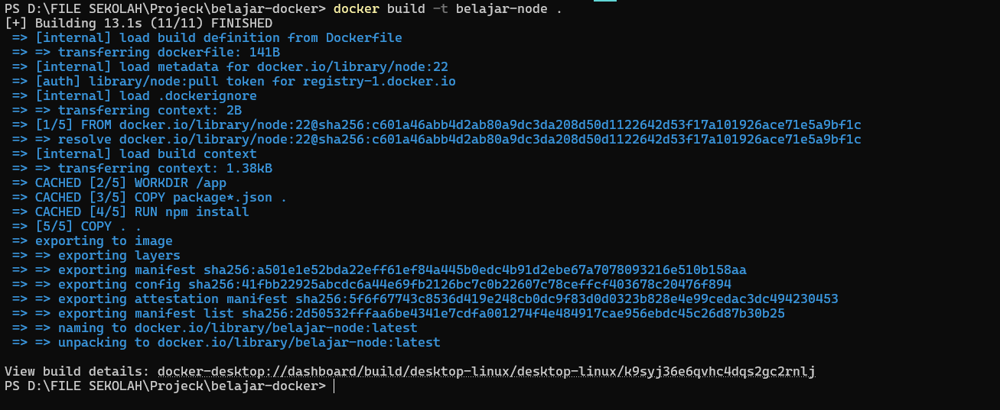
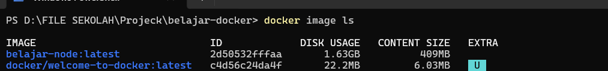
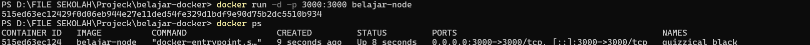
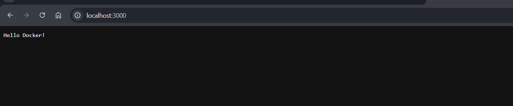

# Dockerfile

## 1. Dockerfile

Pernah kepikiran nggak, gimana caranya kita bisa membuat Docker Image sendiri tanpa harus menginstal aplikasi secara manual setiap kali membuat container?

Di sinilah fungsi **Dockerfile**.

Dockerfile adalah sebuah file yang berisi kumpulan instruksi untuk membuat Docker Image.

Semua langkah seperti menentukan base image, menyalin file, menginstal dependency, hingga menjalankan aplikasi dapat ditulis di dalam Dockerfile.

Dengan begitu, kita tidak perlu mengulang proses yang sama setiap kali ingin membuat Image baru.

## Analogi

Saat belajar, saya menganggap **Dockerfile** seperti **resep masakan**.

Bayangkan kita ingin membuat mie goreng.

Daripada mengingat semua langkah memasaknya setiap kali, kita cukup mengikuti resep yang sudah ditulis.

Begitu juga dengan Dockerfile.

Docker hanya perlu mengikuti setiap instruksi yang ada di dalam file tersebut untuk menghasilkan Image yang sama.

## 2. FROM

Instruksi `FROM` digunakan untuk menentukan **base image** yang akan digunakan sebagai dasar pembuatan Docker Image.

Semua instruksi berikutnya akan dijalankan di atas base image tersebut.

Sebagai contoh, jika kita ingin membuat aplikasi Node.js, maka kita dapat menggunakan image resmi Node.js sebagai dasar.

```dockerfile
FROM node:22
```

### Penjelasan Parameter

| Parameter | Fungsi |
|-----------|--------|
| `FROM` | Menentukan base image yang akan digunakan. |
| `node:22` | Menggunakan image resmi Node.js versi 22 sebagai dasar Docker Image baru. |

### Logic

Saat proses build dimulai, Docker akan mencari image `node:22`.

- Jika image sudah tersedia di komputer, Docker akan langsung menggunakannya.
- Jika belum tersedia, Docker akan mengunduh image tersebut terlebih dahulu dari Docker Hub.

Setelah itu, Docker akan menjalankan seluruh instruksi berikutnya di atas image tersebut.

### Kesimpulan

- `FROM` digunakan untuk menentukan base image.
- Base image menjadi pondasi Docker Image yang akan dibuat.
- Hampir semua Dockerfile diawali dengan instruksi `FROM`.

## 3. WORKDIR

Instruksi `WORKDIR` digunakan untuk menentukan folder kerja di dalam Docker Container.

Semua instruksi berikutnya seperti `COPY`, `RUN`, maupun `CMD` akan dijalankan dari folder tersebut.

Dengan adanya `WORKDIR`, kita tidak perlu menuliskan path folder berulang kali sehingga Dockerfile menjadi lebih rapi.

```dockerfile
WORKDIR /app
```

### Penjelasan Parameter

| Parameter | Fungsi |
|-----------|--------|
| `WORKDIR` | Menentukan folder kerja di dalam container. |
| `/app` | Folder yang akan digunakan sebagai lokasi aplikasi. |

### Logic

Saat Docker menjalankan instruksi `WORKDIR`, Docker akan berpindah ke folder `/app`.

Jika folder tersebut belum ada, Docker akan membuatnya secara otomatis.

Semua instruksi berikutnya akan dijalankan dari folder tersebut sampai ada instruksi `WORKDIR` lain yang mengubah lokasi kerja.

### Kesimpulan

- `WORKDIR` digunakan untuk menentukan folder kerja di dalam container.
- Docker akan membuat folder secara otomatis jika belum tersedia.
- `WORKDIR` membuat Dockerfile lebih rapi karena tidak perlu menuliskan path berulang kali.

## 4. COPY

Instruksi `COPY` digunakan untuk menyalin file atau folder dari komputer (Host) ke dalam Docker Image.

Biasanya instruksi ini digunakan untuk menyalin source code aplikasi, file konfigurasi, atau file lain yang dibutuhkan saat proses build.

```dockerfile
COPY package*.json .
```

### Penjelasan Parameter

| Parameter | Fungsi |
|-----------|--------|
| `COPY` | Menyalin file atau folder dari Host ke dalam Docker Image. |
| `package*.json` | File yang akan disalin ke dalam image. |
| `.` | Menunjukkan folder tujuan, yaitu folder kerja saat ini (`WORKDIR`). |

### Logic

Saat proses build berlangsung, Docker akan mencari file `package*.json` pada folder project.

Setelah ditemukan, Docker akan menyalinnya ke dalam folder kerja yang sudah ditentukan oleh `WORKDIR`.

Pada aplikasi Node.js, file `package.json` biasanya disalin lebih dahulu agar proses instalasi dependency dapat memanfaatkan cache Docker dan build menjadi lebih cepat.

### Kesimpulan

- `COPY` digunakan untuk menyalin file atau folder ke dalam Docker Image.
- File akan disalin ke lokasi yang ditentukan.
- Pada aplikasi Node.js, `package.json` biasanya disalin terlebih dahulu sebelum source code lainnya.

## 5. RUN

Instruksi `RUN` digunakan untuk menjalankan sebuah perintah saat proses **build Docker Image**.

Biasanya instruksi ini digunakan untuk menginstal dependency, mengunduh package, atau melakukan konfigurasi yang dibutuhkan sebelum Image selesai dibuat.

Sebagai contoh, pada aplikasi Node.js kita dapat menginstal seluruh dependency menggunakan perintah berikut.

```dockerfile
RUN npm install
```

### Penjelasan Parameter

| Parameter | Fungsi |
|-----------|--------|
| `RUN` | Menjalankan perintah saat proses build Docker Image. |
| `npm install` | Menginstal seluruh dependency yang terdapat pada file `package.json`. |

### Logic

Saat proses build mencapai instruksi `RUN`, Docker akan menjalankan perintah tersebut di dalam container sementara.

Hasil dari perintah tersebut kemudian akan disimpan ke dalam Docker Image.

Pada contoh di atas, Docker akan menginstal seluruh dependency Node.js sehingga aplikasi sudah siap dijalankan ketika container dibuat.

### Kesimpulan

- `RUN` digunakan untuk menjalankan perintah saat proses build.
- Hasil dari perintah `RUN` akan disimpan ke dalam Docker Image.
- `RUN` sering digunakan untuk menginstal dependency atau melakukan konfigurasi aplikasi.

## 6. EXPOSE

Instruksi `EXPOSE` digunakan untuk memberi tahu bahwa aplikasi di dalam Docker Container menggunakan port tertentu.

Instruksi ini tidak membuka port secara langsung, tetapi hanya menjadi informasi bagi pengguna atau Docker mengenai port yang digunakan oleh aplikasi.

Sebagai contoh, aplikasi Node.js berjalan pada port **3000**.

```dockerfile
EXPOSE 3000
```

### Penjelasan Parameter

| Parameter | Fungsi |
|-----------|--------|
| `EXPOSE` | Memberikan informasi mengenai port yang digunakan aplikasi. |
| `3000` | Port yang digunakan oleh aplikasi di dalam container. |

### Logic

Saat Docker membaca instruksi `EXPOSE`, Docker akan mencatat bahwa aplikasi menggunakan port **3000**.

Namun, port tersebut belum bisa diakses dari luar.

Agar aplikasi dapat diakses melalui browser, kita tetap harus menggunakan **Port Mapping** saat menjalankan container, misalnya:

```bash
docker run -p 3000:3000 nama-image
```

### Kesimpulan

- `EXPOSE` digunakan untuk mendokumentasikan port yang digunakan aplikasi.
- `EXPOSE` tidak sama

## 7. CMD

Instruksi `CMD` digunakan untuk menentukan perintah yang akan dijalankan secara otomatis ketika Docker Container dijalankan.

Biasanya instruksi ini digunakan untuk menjalankan aplikasi utama yang ada di dalam container.

Sebagai contoh, pada aplikasi Node.js kita dapat menjalankan aplikasi menggunakan perintah berikut.

```dockerfile
CMD ["npm", "start"]
```

### Penjelasan Parameter

| Parameter | Fungsi |
|-----------|--------|
| `CMD` | Menentukan perintah yang dijalankan saat container berjalan. |
| `["npm", "start"]` | Menjalankan aplikasi menggunakan perintah `npm start`. |

### Logic

Setelah Docker Image berhasil dibuat dan container dijalankan, Docker akan menjalankan perintah yang terdapat pada `CMD`.

Pada contoh di atas, Docker akan menjalankan `npm start` sehingga aplikasi Node.js langsung berjalan tanpa perlu menjalankan perintah secara manual.

Berbeda dengan `RUN`, instruksi `CMD` dijalankan saat **container berjalan**, bukan saat proses build image.

### Kesimpulan

- `CMD` digunakan untuk menentukan perintah utama saat container dijalankan.
- `CMD` dijalankan setelah container berhasil dibuat dan dijalankan.
- `CMD` berbeda dengan `RUN` karena `RUN` dijalankan saat proses build Docker Image.

## 8. GAMBARAN SELURUH PROSES BUILD DOCKER IMAGE

Berikut adalah gambaran keseluruhan proses build Docker Image menggunakan Dockerfile:

1. `FROM`: Menentukan base image yang akan digunakan sebagai dasar pembuatan Docker Image.
2. `WORKDIR`: Menentukan folder kerja di dalam Docker Container.
3. `COPY`: Menyalin file atau folder dari Host ke dalam Docker Image.
4. `RUN`: Menjalankan perintah saat proses build Docker Image.
5. `EXPOSE`: Memberikan informasi mengenai port yang digunakan aplikasi.
6. `CMD`: Menentukan perintah yang akan dijalankan secara otomatis ketika Docker Container dijalankan.

## 9. Praktik Dockerfile

Pada praktik ini saya akan membangun Docker Image menggunakan Dockerfile yang telah dibuat sebelumnya.

Setelah Image berhasil dibuat, saya akan menjalankan container dan memastikan aplikasi dapat diakses melalui browser.

```bash
docker build -t belajar-node .
```

### Penjelasan Parameter

| Parameter | Fungsi |
|-----------|--------|
| docker build | Membangun Docker Image dari Dockerfile. |
| -t | Memberikan nama (tag) pada Image. |
| belajar-node | Nama Image yang dibuat. |
| . | Menggunakan folder saat ini sebagai Build Context. |

### Logic

Saat command dijalankan, Docker akan membaca Dockerfile dari atas ke bawah.

Docker kemudian menjalankan setiap instruksi seperti `FROM`, `WORKDIR`, `COPY`, `RUN`, `EXPOSE`, dan `CMD` hingga menghasilkan Docker Image baru.

### Hasil Praktik

<p align="center">
  
</p>

Image yang berhasil dibuat dapat dilihat menggunakan command berikut.

```bash
docker images
```

<p align="center">
  
</p>

Selanjutnya Image dijalankan menjadi sebuah container.

```bash
docker run -d -p 3000:3000 belajar-node
```

<p align="center">
  
</p>

Setelah container berjalan, aplikasi berhasil diakses melalui browser.

### Hasil Praktik

<p align="center">
  
</p>

### Kesimpulan

- Dockerfile dapat digunakan untuk membangun Docker Image secara otomatis.
- Docker menjalankan setiap instruksi dari atas ke bawah.
- Image yang berhasil dibuat dapat dijalankan menjadi Docker Container.
- Aplikasi berhasil diakses melalui browser setelah container dijalankan.