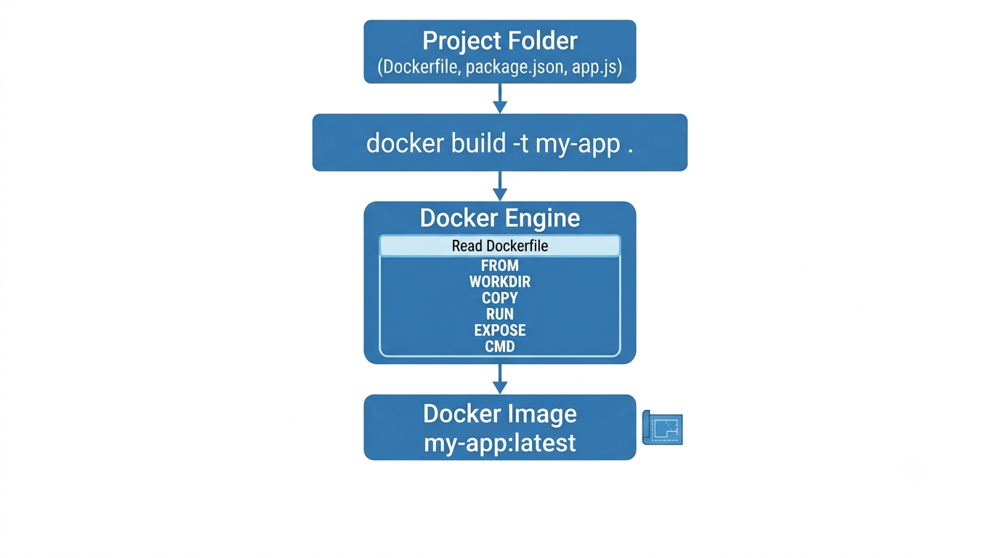
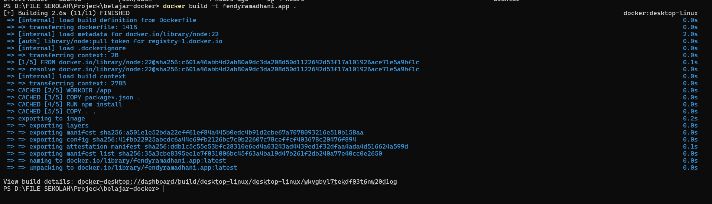
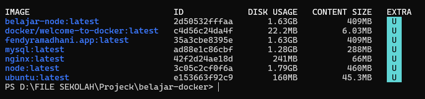

# Image Build

## 1. Image Build

Setelah Dockerfile selesai dibuat, langkah berikutnya adalah membangun Docker Image.

Proses ini disebut **Image Build**.

Docker akan membaca seluruh isi Dockerfile dari atas ke bawah, kemudian menjalankan setiap instruksi hingga menghasilkan sebuah Docker Image baru.

Image tersebut nantinya dapat digunakan untuk membuat satu atau bahkan banyak Docker Container.

## Analogi

Saat belajar, saya menganggap **Image Build** seperti **membangun sebuah rumah berdasarkan blueprint**.

Dockerfile adalah blueprint atau gambar rumah.

Sedangkan proses Build adalah kegiatan membangun rumah tersebut.

Jika seluruh proses selesai, hasil akhirnya adalah sebuah rumah yang siap ditempati.

Begitu juga dengan Docker. Docker membaca Dockerfile, menjalankan setiap instruksi, kemudian menghasilkan Docker Image yang siap digunakan.

## 2. docker build

Command `docker build` digunakan untuk membangun Docker Image berdasarkan Dockerfile yang berada di dalam sebuah folder.

```bash
docker build -t belajar-node .
```

### Penjelasan Parameter

| Parameter | Fungsi |
|-----------|--------|
| `docker build` | Membangun Docker Image dari Dockerfile. |
| `-t` | Memberikan nama (tag) pada Docker Image. |
| `belajar-node` | Nama Docker Image yang akan dibuat. |
| `.` | Menggunakan folder saat ini sebagai Build Context. |

### Logic

Saat command dijalankan, Docker akan mencari file `Dockerfile` pada folder saat ini.

Kemudian Docker membaca setiap instruksi mulai dari `FROM`, `WORKDIR`, `COPY`, `RUN`, `EXPOSE`, hingga `CMD`.

Jika seluruh proses berhasil, Docker akan menghasilkan Docker Image baru dengan nama `belajar-node`.

> **Catatan**

Jika Dockerfile berada di folder lain atau memiliki nama yang berbeda, kita dapat menentukan lokasinya menggunakan parameter `-f`.

### Kesimpulan

- `docker build` digunakan untuk membangun Docker Image.
- Docker membaca Dockerfile dari atas ke bawah.
- Hasil akhirnya adalah Docker Image yang siap digunakan untuk membuat container.

## 3. Image Tag

Saat membangun Docker Image, kita biasanya memberikan nama pada Image tersebut menggunakan parameter `-t`.

Nama ini disebut **Tag**.

Tag berfungsi agar Docker Image lebih mudah dikenali, terutama jika kita memiliki banyak Image di dalam komputer.

Sebagai contoh:

```bash
docker build -t belajar-node .
```

Pada command di atas, Image akan dibuat dengan nama `belajar-node`.

> **Catatan**

Nama Image setelah parameter `-t` dapat ditentukan sesuai kebutuhan.

Sebaiknya gunakan nama yang mudah dikenali agar lebih mudah dikelola.

### Analogi

Saat belajar, saya menganggap **Image Tag** seperti **memberi nama file**.

Bayangkan kita menyimpan sebuah dokumen.

Kalau namanya hanya **Document1**, lama-kelamaan kita akan bingung karena jumlah dokumen semakin banyak.

Begitu juga dengan Docker Image.

Memberikan nama yang jelas akan memudahkan kita saat ingin menjalankan, menghapus, atau memperbarui Image tersebut.

### Penjelasan Parameter

| Parameter | Fungsi |
|-----------|--------|
| `-t` | Memberikan nama (tag) pada Docker Image. |
| `belajar-node` | Nama Docker Image yang akan dibuat. |

### Logic

Saat proses build selesai, Docker akan menyimpan Image dengan nama yang telah ditentukan.

Nama tersebut nantinya dapat digunakan saat menjalankan container menggunakan `docker run`.

### Kesimpulan

- Tag digunakan untuk memberikan nama pada Docker Image.
- Nama Image memudahkan proses pengelolaan Image.
- Sebaiknya gunakan nama yang mudah dikenali sesuai fungsi aplikasi.

## 4. Build Context

Saat menjalankan command `docker build`, kita biasanya menambahkan tanda titik (`.`) di bagian akhir.

```bash
docker build -t belajar-node .
```

Tanda titik (`.`) tersebut disebut **Build Context**.

Build Context adalah folder yang akan digunakan Docker sebagai sumber file saat proses build berlangsung.

Semua file yang berada di dalam folder tersebut dapat digunakan oleh Dockerfile, misalnya saat menggunakan instruksi `COPY`.

### Analogi

Saat belajar, saya menganggap **Build Context** seperti **tas yang dibawa tukang bangunan**.

Bayangkan seorang tukang ingin membangun sebuah rumah.

Sebelum bekerja, semua alat dan bahan harus dimasukkan ke dalam tas terlebih dahulu.

Docker juga bekerja dengan cara yang sama.

Folder yang kita berikan sebagai Build Context menjadi tempat Docker mengambil semua file yang dibutuhkan selama proses build.

### Penjelasan Parameter

| Parameter | Fungsi |
|-----------|--------|
| `.` | Menggunakan folder saat ini sebagai Build Context. |

### Logic

Saat command dijalankan, Docker akan menggunakan folder tersebut sebagai sumber file selama proses build berlangsung.

Kemudian Docker membaca Dockerfile dan mengambil file yang dibutuhkan, misalnya melalui instruksi `COPY`.

Jika file yang ingin disalin berada di luar Build Context, Docker tidak dapat mengaksesnya.

> **Catatan**
Karena Docker menggunakan seluruh isi Build Context saat proses build, sebaiknya gunakan file `.dockerignore` untuk mengecualikan file yang tidak diperlukan agar proses build lebih cepat.

### Kesimpulan

- Build Context adalah folder yang digunakan Docker saat proses build.
- Docker hanya dapat mengakses file yang berada di dalam Build Context.
- File yang tidak diperlukan sebaiknya dikecualikan menggunakan `.dockerignore`.

## 5. Praktik Image Build

Pada praktik ini saya akan membangun Docker Image menggunakan Dockerfile yang telah dibuat sebelumnya.

```bash
docker build -t belajar-node .
```

### Penjelasan Parameter

| Parameter | Fungsi |
|-----------|--------|
| docker build | Membangun Docker Image dari Dockerfile. |
| -t | Memberikan nama pada Docker Image. |
| belajar-node | Nama Docker Image. |
| . | Menggunakan folder saat ini sebagai Build Context. |

### Logic

Docker akan membaca Dockerfile dari atas ke bawah.

Jika seluruh proses berhasil, Docker akan menghasilkan Docker Image baru dengan nama `belajar-node`.

### Ilustrasi

<p align="center">
  
</p>

### Hasil Praktik

<p align="center">
  
</p>

Setelah proses build selesai, Image dapat dilihat menggunakan command berikut.

```bash
docker images ls
```

<p align="center">
  
</p>
 

### Kesimpulan

- Docker Image berhasil dibuat.
- Image dapat digunakan untuk membuat Docker Container.
- Image dapat dilihat menggunakan `docker images`.