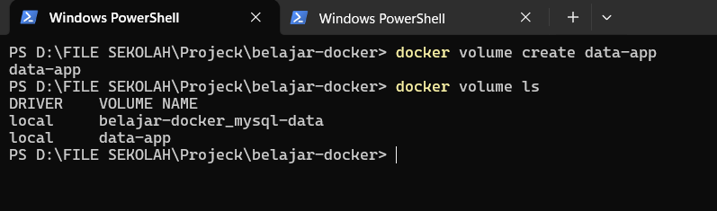
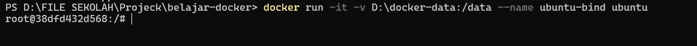

# Storage

## 1. Docker Storage

Secara default, semua data yang ada di dalam Docker Container akan ikut hilang ketika container dihapus.

Karena itu, Docker menyediakan fitur **Storage** agar data tetap tersimpan meskipun container sudah tidak ada.

Storage biasanya digunakan untuk menyimpan data aplikasi, database, log, maupun file lain yang perlu dipertahankan.

## Analogi

Saat belajar, saya menganggap **Docker Storage** seperti **lemari penyimpanan**.

Bayangkan kita memiliki sebuah rumah kontrakan.

Kalau rumah tersebut dibongkar, semua barang di dalamnya akan ikut hilang.

Agar barang tetap aman, kita menyimpannya di sebuah gudang terpisah.

Begitu juga dengan Docker.

Meskipun container dihapus, data yang disimpan di Storage tetap aman dan dapat digunakan kembali oleh container lain.

## 2. Docker Volume

Docker Volume adalah media penyimpanan yang dikelola langsung oleh Docker.

Data yang disimpan di dalam Volume akan tetap ada meskipun container dihapus.

Karena itu, Docker Volume sering digunakan untuk menyimpan data yang penting, seperti database, file aplikasi, maupun konfigurasi.

### Analogi

Saat belajar, saya menganggap **Docker Volume** seperti **gudang penyimpanan**.

Bayangkan kita memiliki sebuah toko.

Meskipun tokonya direnovasi atau bahkan dibangun ulang, seluruh barang tetap aman karena disimpan di gudang.

Begitu juga dengan Docker Volume.

Walaupun container dihapus, data yang berada di dalam Volume tetap tersimpan dan dapat digunakan kembali oleh container baru.

```bash
docker volume create data-app
```

### Penjelasan Parameter

| Parameter | Fungsi |
|-----------|--------|
| `docker volume` | Digunakan untuk mengelola Docker Volume. |
| `create` | Membuat Docker Volume baru. |
| `data-app` | Nama Docker Volume yang akan dibuat. |

### Logic

Saat command dijalankan, Docker akan membuat sebuah Volume baru dengan nama `data-app`.

Volume tersebut belum terhubung ke container mana pun, tetapi sudah siap digunakan sebagai tempat penyimpanan data.

Ketika Volume dipasang ke sebuah container, data yang disimpan akan tetap ada meskipun container dihapus.

### Hasil Praktik

Volume yang berhasil dibuat dapat dilihat menggunakan command berikut.

```bash
docker volume ls
```

<p align="center">
  
</p>

### Kesimpulan

- Docker Volume digunakan untuk menyimpan data secara permanen.
- Data pada Volume tidak ikut terhapus saat container dihapus.
- Docker mengelola Volume secara otomatis sehingga lebih aman untuk menyimpan data aplikasi.

## 3. Bind Mount

Bind Mount adalah fitur Docker yang digunakan untuk menghubungkan sebuah folder atau file dari komputer (Host) ke dalam Docker Container.

Dengan Bind Mount, perubahan yang dilakukan pada file di komputer akan langsung terlihat di dalam container, begitu juga sebaliknya.

Fitur ini sering digunakan saat proses development karena kita tidak perlu membangun ulang Docker Image setiap kali ada perubahan pada source code.

### Analogi

Saat belajar, saya menganggap **Bind Mount** seperti **kabel ekstensi**.

Bayangkan komputer kita dan Docker Container berada di dua ruangan yang berbeda.

Bind Mount berfungsi seperti kabel yang langsung menghubungkan kedua ruangan tersebut.

Selama kabel tersebut terhubung, perubahan yang dilakukan di salah satu sisi akan langsung terlihat di sisi lainnya.

```bash
docker run -it -v D:\docker-data:/data --name ubuntu-bind ubuntu
```

### Penjelasan Parameter

| Parameter | Fungsi |
|-----------|--------|
| `docker run` | Membuat sekaligus menjalankan container baru. |
| `-it` | Menjalankan container dalam mode interaktif. |
| `-v` | Menghubungkan folder Host ke dalam container. |
| `D:\docker-data:/data` | Folder `D:\docker-data` pada Host dihubungkan ke folder `/data` di dalam container. |
| `--name ubuntu-bind` | Memberikan nama `ubuntu-bind` pada container. |
| `ubuntu` | Image yang digunakan untuk membuat container. |

### Logic

Saat command dijalankan, Docker akan menghubungkan folder `D:\docker-data` di komputer dengan folder `/data` di dalam container.

Semua perubahan yang dilakukan pada salah satu folder akan langsung terlihat pada folder lainnya selama container masih menggunakan Bind Mount tersebut.


### Hasil Praktik

<p align="center">
  
</p>

### Kesimpulan

- Bind Mount menghubungkan folder dari Host ke dalam Docker Container.
- Perubahan file akan langsung tersinkronisasi antara Host dan Container.
- Bind Mount sangat cocok digunakan saat proses development.

## 4. Perbedaan Docker Volume dan Bind Mount

Docker Volume dan Bind Mount sama-sama digunakan untuk menyimpan data di luar Docker Container.

Namun, keduanya memiliki cara kerja dan tujuan yang berbeda.

Docker Volume dikelola langsung oleh Docker, sedangkan Bind Mount menggunakan folder atau file yang ada di komputer (Host).

### Ilustrasi

### Perbandingan

| Docker Volume | Bind Mount |
|---------------|------------|
| Dikelola langsung oleh Docker. | Menggunakan folder atau file dari Host. |
| Data tetap tersimpan meskipun container dihapus. | Data berada langsung di folder Host. |
| Cocok untuk database dan data penting. | Cocok untuk development dan pengujian aplikasi. |
| Lokasi penyimpanan diatur Docker. | Lokasi penyimpanan ditentukan oleh pengguna. |

### Logic

Jika tujuan kita adalah menyimpan data aplikasi atau database dalam jangka panjang, Docker Volume menjadi pilihan yang lebih tepat.

Namun, jika kita ingin mengedit source code secara langsung dari komputer dan perubahan tersebut langsung terlihat di dalam container, maka Bind Mount lebih cocok digunakan.

### Kesimpulan

- Docker Volume cocok untuk menyimpan data penting yang dikelola Docker.
- Bind Mount cocok untuk proses development karena terhubung langsung dengan folder di Host.
- Pilih jenis Storage sesuai kebutuhan aplikasi yang akan dibuat.