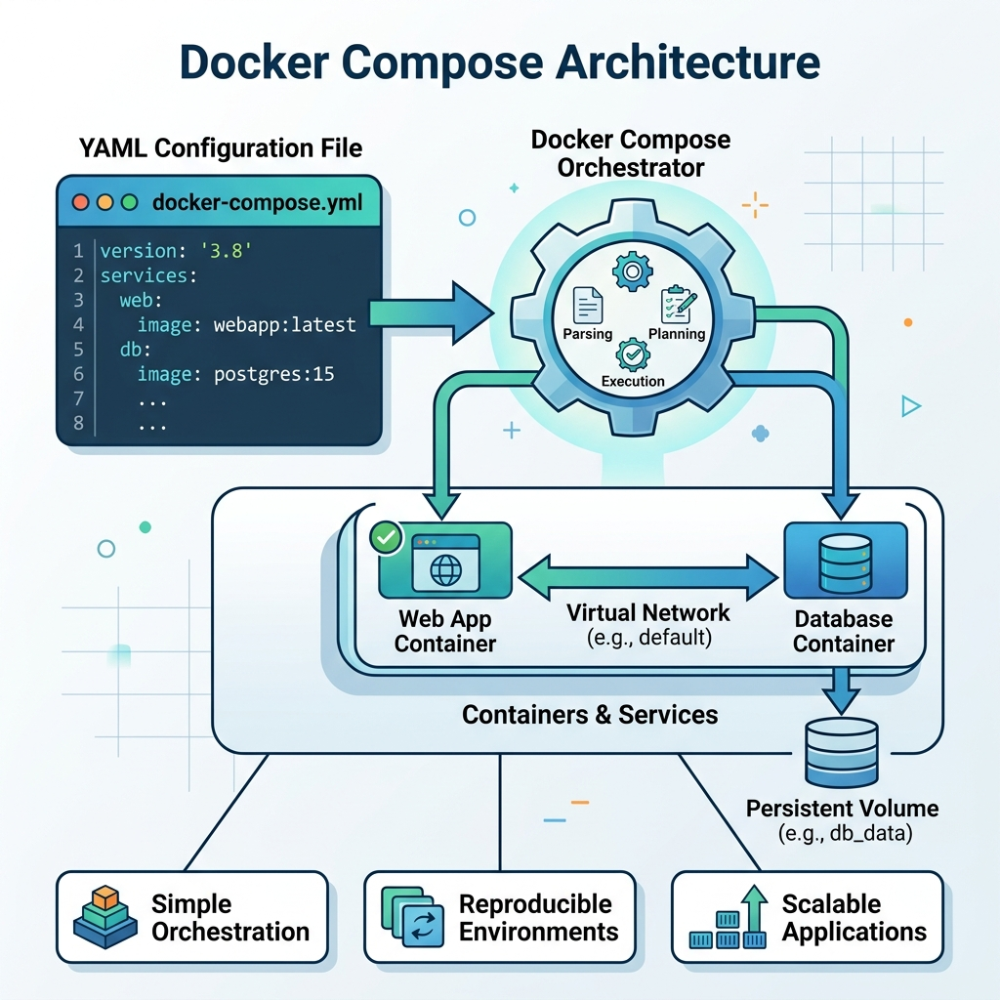
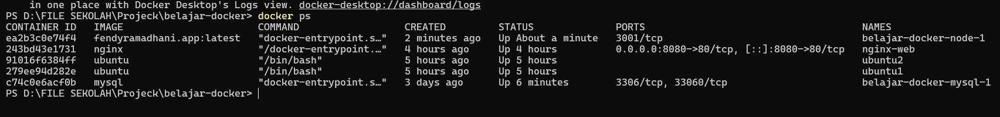

# Docker Compose

## 1. Docker Compose

Saat aplikasi mulai berkembang, kita biasanya membutuhkan lebih dari satu container.

Sebagai contoh, sebuah aplikasi Node.js membutuhkan database MySQL agar dapat menyimpan data.

Kalau semua container dijalankan satu per satu menggunakan `docker run`, lama-kelamaan prosesnya akan menjadi lebih rumit.

Karena itu, Docker menyediakan **Docker Compose**.

Docker Compose digunakan untuk mengelola beberapa container sekaligus menggunakan satu file konfigurasi.

Dengan begitu, kita cukup menjalankan satu command untuk membuat seluruh container yang dibutuhkan.

## Analogi

Saat belajar, saya menganggap **Docker Compose** seperti **seorang konduktor orkestra**.

Bayangkan sebuah pertunjukan musik.

Di dalamnya ada pemain drum, gitar, piano, dan biola.

Masing-masing memiliki tugas yang berbeda, tetapi semuanya harus dimainkan secara bersamaan agar menghasilkan musik yang indah.

Docker Compose bekerja dengan cara yang sama.

Ia mengatur beberapa container agar dapat berjalan bersama sebagai satu aplikasi.

## 2. compose.yaml

Docker Compose menggunakan sebuah file konfigurasi yang biasanya bernama `compose.yaml`.

File ini berisi seluruh konfigurasi container yang akan dijalankan, seperti Image, Port, Volume, Network, hingga Environment Variable.

Dengan adanya file ini, kita tidak perlu lagi menjalankan banyak command `docker run`.

Contoh sederhana:

```yaml
services:
  web:
    image: nginx
    ports:
      - "8080:80"
```

### Penjelasan

| Bagian | Fungsi |
|--------|--------|
| `services` | Daftar container yang akan dijalankan. |
| `web` | Nama service. |
| `image` | Docker Image yang digunakan. |
| `ports` | Port Mapping antara Host dan Container. |

### Logic

Saat Docker Compose dijalankan, Docker akan membaca file `compose.yaml`.

Kemudian Docker membuat seluruh container sesuai konfigurasi yang telah ditentukan.

### Kesimpulan

- `compose.yaml` adalah file konfigurasi Docker Compose.
- Semua konfigurasi aplikasi ditulis dalam satu file.
- Docker Compose akan membaca file tersebut saat dijalankan.

## 3. Services

Di dalam file `compose.yaml`, setiap container ditulis sebagai sebuah **service**.

Setiap service memiliki tugasnya masing-masing.

Sebagai contoh, sebuah aplikasi web dapat menggunakan satu service untuk Node.js dan satu service lagi untuk MySQL.

Meskipun berjalan sebagai container yang berbeda, seluruh service dapat dijalankan secara bersamaan menggunakan Docker Compose.

### Analogi

Saat belajar, saya menganggap **Service** seperti **anggota sebuah tim**.

Bayangkan kita sedang membuat sebuah tim sepak bola.

Ada penjaga gawang, bek, gelandang, dan penyerang.

Masing-masing memiliki tugas yang berbeda, tetapi semuanya bekerja sama agar tim dapat bermain dengan baik.

Begitu juga dengan Docker Compose.

Setiap service memiliki tugasnya sendiri, tetapi seluruh service bekerja sama membentuk satu aplikasi.

```yaml
services:
  app:
    image: node:22

  database:
    image: mysql:8
```

### Penjelasan

| Bagian | Fungsi |
|--------|--------|
| `services` | Tempat mendefinisikan seluruh service. |
| `app` | Service yang menjalankan aplikasi Node.js. |
| `database` | Service yang menjalankan MySQL. |
| `image` | Docker Image yang digunakan oleh service. |

### Logic

Saat Docker Compose dijalankan, setiap service akan dibuat menjadi container yang terpisah.

Docker Compose juga akan menghubungkan seluruh service ke dalam network yang sama sehingga mereka dapat saling berkomunikasi.

### Kesimpulan

- Service adalah sebuah container yang dikelola oleh Docker Compose.
- Satu aplikasi dapat terdiri dari beberapa service.
- Docker Compose menjalankan seluruh service secara bersamaan.

## 4. Ports

Sama seperti saat menggunakan `docker run`, Docker Compose juga mendukung **Port Mapping**.

Port Mapping digunakan agar aplikasi yang berjalan di dalam container dapat diakses dari luar, misalnya melalui browser.

Perbedaannya, pada Docker Compose konfigurasi Port Mapping ditulis langsung di dalam file `compose.yaml`.

```yaml
services:
  web:
    image: nginx
    ports:
      - "8080:80"
```

### Analogi

Saat belajar, saya menganggap **Ports** seperti **gerbang masuk sebuah gedung**.

Bayangkan sebuah gedung memiliki banyak ruangan.

Pengunjung tidak bisa langsung masuk ke ruangan tertentu.

Mereka harus melewati gerbang utama terlebih dahulu.

Begitu juga dengan Docker Compose.

Port pada Host menjadi pintu masuk, sedangkan port di dalam Container menjadi tujuan akhirnya.

### Penjelasan

| Bagian | Fungsi |
|--------|--------|
| `ports` | Mengatur Port Mapping antara Host dan Container. |
| `"8080:80"` | Host Port **8080** dihubungkan ke Container Port **80**. |

### Logic

Saat Docker Compose dijalankan, Docker akan membuat Port Mapping sesuai konfigurasi yang ada di dalam file `compose.yaml`.

Ketika browser mengakses `http://localhost:8080`, Docker akan meneruskan permintaan tersebut ke aplikasi yang berjalan pada **port 80** di dalam container.

> **Catatan**

Konsep Port Mapping pada Docker Compose sama dengan yang telah dipelajari pada **Module 04**.

Perbedaannya hanya pada cara penulisannya, yaitu menggunakan file `compose.yaml`.

### Kesimpulan

- `ports` digunakan untuk mengatur Port Mapping pada Docker Compose.
- Browser mengakses aplikasi melalui Host Port.
- Docker akan meneruskan permintaan ke Container Port sesuai konfigurasi.

## 5. Volumes

Docker Compose juga mendukung penggunaan **Docker Volume** untuk menyimpan data di luar container.

Dengan begitu, data tetap tersimpan meskipun container dihentikan atau dihapus.

Konfigurasi Volume ditulis langsung di dalam file `compose.yaml` sehingga Docker akan memasangnya secara otomatis saat container dijalankan.

```yaml
services:
  database:
    image: mysql:8
    volumes:
      - mysql-data:/var/lib/mysql

volumes:
  mysql-data:
```

### Analogi

Saat belajar, saya menganggap **Volumes** seperti **gudang bersama**.

Bayangkan sebuah toko memiliki gudang untuk menyimpan seluruh barang.

Meskipun tokonya direnovasi atau bahkan dibangun ulang, seluruh barang tetap aman karena berada di gudang tersebut.

Begitu juga dengan Docker Compose.

Container dapat berganti, tetapi data yang berada di dalam Docker Volume tetap tersimpan.

### Penjelasan

| Bagian | Fungsi |
|--------|--------|
| `volumes` (service) | Menghubungkan Docker Volume ke dalam container. |
| `mysql-data` | Nama Docker Volume. |
| `/var/lib/mysql` | Lokasi penyimpanan data MySQL di dalam container. |
| `volumes:` (bagian bawah) | Mendefinisikan Docker Volume yang akan dibuat. |

### Logic

Saat Docker Compose dijalankan, Docker akan membuat Volume `mysql-data` jika belum tersedia.

Kemudian Volume tersebut dipasang ke folder `/var/lib/mysql` di dalam container MySQL.

Semua data database akan disimpan ke Volume sehingga tidak hilang ketika container dihapus.

> **Catatan**

Konsep Docker Volume telah dipelajari pada **Module 07**.

Pada Docker Compose, kita hanya mendefinisikannya melalui file `compose.yaml`, sedangkan proses pembuatannya dilakukan secara otomatis oleh Docker.

### Kesimpulan

- `volumes` digunakan untuk menyimpan data di luar container.
- Docker akan membuat Volume secara otomatis jika belum tersedia.
- Data tetap aman meskipun container dihapus atau dibuat kembali.

## 6. Environment Variables

Docker Compose mendukung penggunaan **Environment Variables** untuk menyimpan konfigurasi aplikasi.

Dengan cara ini, kita tidak perlu menuliskan nilai konfigurasi secara langsung di dalam source code.

Environment Variable sering digunakan untuk menyimpan informasi seperti username database, password, nama database, maupun konfigurasi aplikasi lainnya.

```yaml
services:
  database:
    image: mysql:8
    environment:
      MYSQL_ROOT_PASSWORD: root123
      MYSQL_DATABASE: belajar_docker
```

### Analogi

Saat belajar, saya menganggap **Environment Variable** seperti **pengaturan pada sebuah aplikasi**.

Bayangkan kita baru menginstal sebuah aplikasi di HP.

Sebelum digunakan, kita perlu mengatur bahasa, tema, atau akun yang akan digunakan.

Begitu juga dengan Docker Compose.

Environment Variable digunakan untuk memberikan konfigurasi kepada container sebelum aplikasi dijalankan.

### Penjelasan

| Bagian | Fungsi |
|--------|--------|
| `environment` | Tempat mendefinisikan Environment Variable. |
| `MYSQL_ROOT_PASSWORD` | Password untuk akun root MySQL. |
| `MYSQL_DATABASE` | Nama database yang akan dibuat saat container pertama kali dijalankan. |

### Logic

Saat Docker Compose menjalankan service, seluruh Environment Variable akan dikirim ke dalam container.

Aplikasi di dalam container kemudian membaca nilai tersebut sebagai konfigurasi awal.

> **Catatan**

Untuk project yang lebih besar, sebaiknya Environment Variable disimpan di dalam file `.env` agar lebih mudah dikelola dan tidak memenuhi file `compose.yaml`.

### Kesimpulan

- `environment` digunakan untuk memberikan konfigurasi kepada container.
- Environment Variable memudahkan pengelolaan konfigurasi aplikasi.
- Untuk project yang lebih kompleks, sebaiknya gunakan file `.env`.

## 7. Networks

Secara default, Docker Compose akan membuat sebuah Docker Network untuk seluruh service yang ada di dalam file `compose.yaml`.

Dengan begitu, setiap service dapat saling berkomunikasi menggunakan nama service tanpa perlu mengetahui alamat IP masing-masing.

Sebagai contoh, service `app` dapat langsung terhubung ke service `database` menggunakan nama `database`.

```yaml
services:
  app:
    image: node:22

  database:
    image: mysql:8

networks:
  default:
```

### Analogi

Saat belajar, saya menganggap **Docker Compose Network** seperti **sebuah perumahan**.

Bayangkan setiap rumah adalah sebuah service.

Karena seluruh rumah berada di dalam satu komplek, setiap penghuni dapat saling mengunjungi hanya dengan mengetahui nomor atau nama rumahnya.

Begitu juga dengan Docker Compose.

Seluruh service berada di dalam network yang sama sehingga dapat saling berkomunikasi menggunakan nama service.

### Penjelasan

| Bagian | Fungsi |
|--------|--------|
| `networks` | Mendefinisikan Docker Network yang akan digunakan. |
| `default` | Network bawaan yang dibuat Docker Compose. |

### Logic

Saat Docker Compose dijalankan, Docker akan membuat sebuah network jika belum tersedia.

Seluruh service kemudian akan otomatis dihubungkan ke network tersebut.

Karena berada di dalam network yang sama, setiap service dapat saling berkomunikasi menggunakan nama service tanpa perlu mengetahui alamat IP.

> **Catatan**

Konsep Docker Network telah dipelajari pada **Module 03**.

Docker Compose akan membuat network secara otomatis sehingga kita tidak perlu menjalankan `docker network create` secara manual untuk kasus sederhana.

### Kesimpulan

- Docker Compose membuat Docker Network secara otomatis.
- Seluruh service akan bergabung ke network yang sama.
- Service dapat saling berkomunikasi menggunakan nama service.

## 8. docker compose up

Command `docker compose up` digunakan untuk membuat sekaligus menjalankan seluruh service yang telah didefinisikan di dalam file `compose.yaml`.

Docker akan membaca seluruh konfigurasi, kemudian membuat Network, Volume (jika ada), dan Container secara otomatis.

```bash
docker compose up -d
```

### Analogi

Saat belajar, saya menganggap **docker compose up** seperti **menekan tombol ON pada sebuah mesin**.

Bayangkan sebuah pabrik memiliki banyak mesin yang saling berhubungan.

Daripada menyalakan satu per satu, kita cukup menekan satu tombol untuk menjalankan semuanya sekaligus.

Begitu juga dengan Docker Compose.

Cukup satu command, seluruh service akan dijalankan sesuai konfigurasi yang ada di dalam `compose.yaml`.

### Penjelasan Parameter

| Parameter | Fungsi |
|-----------|--------|
| `docker compose` | Menjalankan Docker Compose. |
| `up` | Membuat dan menjalankan seluruh service. |
| `-d` | Menjalankan seluruh container di background (Detached Mode). |

### Logic

Saat command dijalankan, Docker Compose akan membaca file `compose.yaml`.

Kemudian Docker akan membuat Network, Volume, dan Container sesuai konfigurasi yang telah ditentukan.

Jika Docker Image belum tersedia di komputer, Docker akan mengunduh atau membangun Image terlebih dahulu sebelum menjalankan container.

> **Catatan**

Jika tidak menggunakan parameter `-d`, seluruh log container akan langsung ditampilkan di terminal.

### Kesimpulan

- `docker compose up` digunakan untuk membuat sekaligus menjalankan seluruh service.
- Docker Compose akan membaca konfigurasi dari file `compose.yaml`.
- Parameter `-d` membuat container berjalan di background.

## 9. docker compose down

Command `docker compose down` digunakan untuk menghentikan sekaligus menghapus seluruh container, network, dan resource yang dibuat oleh Docker Compose.

Command ini biasanya digunakan ketika aplikasi sudah tidak diperlukan lagi atau saat ingin memulai ulang seluruh environment.

```bash
docker compose down
```

### Analogi

Saat belajar, saya menganggap **docker compose down** seperti **mematikan seluruh peralatan di sebuah kantor saat jam kerja selesai**.

Bayangkan sebuah kantor memiliki komputer, lampu, AC, dan printer yang sedang digunakan.

Daripada mematikannya satu per satu, kita cukup menekan saklar utama agar semuanya berhenti bekerja.

Begitu juga dengan Docker Compose.

Satu command dapat menghentikan seluruh service yang sebelumnya dijalankan menggunakan `docker compose up`.

### Penjelasan Parameter

| Parameter | Fungsi |
|-----------|--------|
| `docker compose` | Menjalankan Docker Compose. |
| `down` | Menghentikan dan menghapus seluruh resource yang dibuat Docker Compose. |

### Logic

Saat command dijalankan, Docker Compose akan menghentikan seluruh container yang sedang berjalan.

Setelah itu, Docker akan menghapus container dan network yang dibuat oleh Docker Compose.

Namun, Docker Volume tidak akan ikut dihapus sehingga data tetap aman.

> **Catatan**

Jika ingin menghapus Docker Volume sekaligus, gunakan parameter `-v`.

```bash
docker compose down -v
```

Gunakan parameter tersebut dengan hati-hati karena data yang tersimpan di dalam Docker Volume juga akan ikut dihapus.

### Kesimpulan

- `docker compose down` digunakan untuk menghentikan seluruh service.
- Docker Compose juga akan menghapus container dan network yang dibuatnya.
- Docker Volume tidak ikut dihapus kecuali menggunakan parameter `-v`.

## 10. Praktik Docker Compose

Pada praktik ini saya akan menjalankan sebuah aplikasi sederhana menggunakan Docker Compose.

Aplikasi terdiri dari dua service, yaitu **Node.js** sebagai aplikasi utama dan **MySQL** sebagai database.

Seluruh konfigurasi ditulis di dalam file `compose.yaml`, sehingga seluruh service dapat dijalankan hanya dengan satu command.

```bash
docker compose up -d
```

### Penjelasan Parameter

| Parameter | Fungsi |
|-----------|--------|
| `docker compose` | Menjalankan Docker Compose. |
| `up` | Membuat sekaligus menjalankan seluruh service. |
| `-d` | Menjalankan container di background (Detached Mode). |

### Logic

Saat command dijalankan, Docker Compose akan membaca file `compose.yaml`.

Docker kemudian akan membuat Docker Network, Docker Volume (jika ada), serta seluruh container yang telah didefinisikan.

Jika terdapat Docker Image yang belum tersedia, Docker akan membangun atau mengunduh Image tersebut terlebih dahulu.

Setelah seluruh proses selesai, aplikasi siap digunakan.

### Ilustrasi

<p align="center">
  
</p>

### Hasil Praktik

Seluruh container berhasil dijalankan menggunakan Docker Compose.

```bash
docker compose ps
```

<p align="center">
  
</p>

Aplikasi kemudian dapat diakses melalui browser menggunakan Host Port yang telah dikonfigurasi.

<p align="center">
  
</p>

### Kesimpulan

- Docker Compose memudahkan pengelolaan beberapa container dalam satu aplikasi.
- Seluruh konfigurasi disimpan di dalam file `compose.yaml`.
- Satu command dapat membuat dan menjalankan seluruh service yang dibutuhkan.
