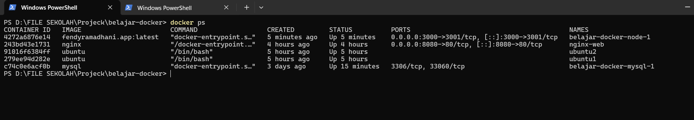
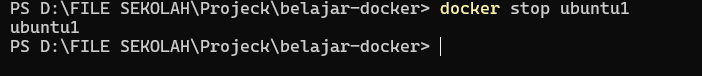
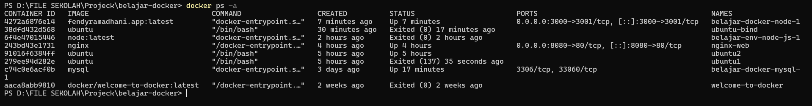
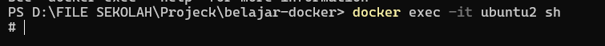
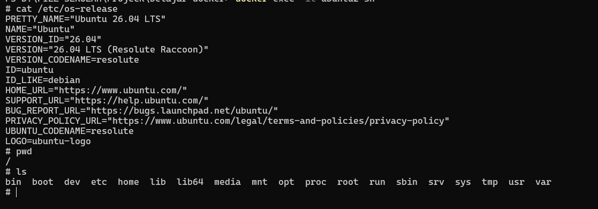
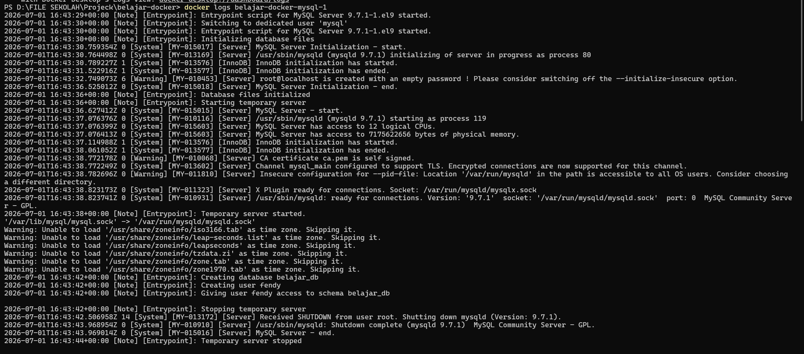
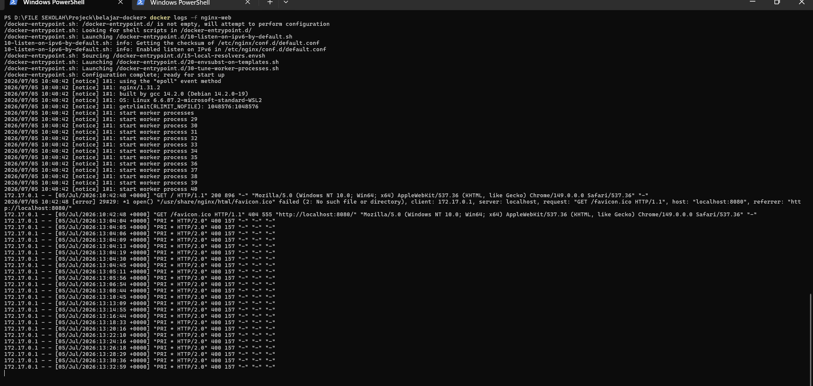
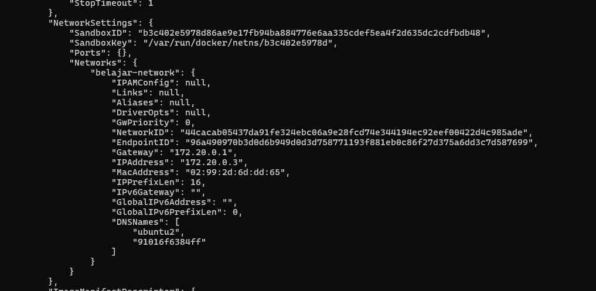
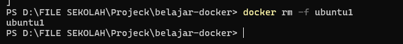
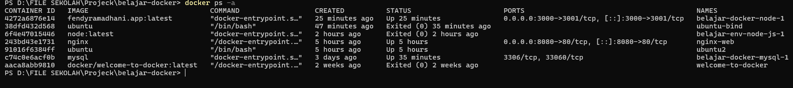

# Container Management

## 1. Container Management

Setelah container berhasil dibuat, pekerjaan kita belum selesai.

Dalam penggunaan sehari-hari, kita akan sering melihat daftar container, menjalankan kembali container yang berhenti, menghentikan container, melihat log aplikasi, hingga menghapus container yang sudah tidak digunakan.

Seluruh aktivitas tersebut disebut **Container Management**.

Docker menyediakan berbagai command untuk mengelola container agar proses development maupun deployment menjadi lebih mudah.

## Analogi

Saat belajar, saya menganggap **Container Management** seperti **mengelola sebuah garasi mobil**.

Bayangkan kita memiliki beberapa mobil.

Ada mobil yang sedang digunakan, ada yang diparkir, ada yang perlu diservis, bahkan ada yang sudah tidak dipakai lagi.

Kita tentu perlu mengetahui kondisi setiap mobil agar garasi tetap rapi.

Begitu juga dengan Docker.

Container perlu dikelola dengan baik agar aplikasi tetap berjalan sesuai kebutuhan.

## 2. docker ps

Command `docker ps` digunakan untuk melihat daftar container yang sedang berjalan.

Command ini merupakan salah satu command yang paling sering digunakan saat bekerja dengan Docker.

```bash
docker ps
```

### Analogi

Saat belajar, saya menganggap **docker ps** seperti **melihat daftar kendaraan yang sedang berada di area parkir**.

Bayangkan sebuah gedung memiliki area parkir.

Dengan melihat daftar kendaraan yang sedang terparkir, kita dapat mengetahui kendaraan mana yang masih berada di dalam gedung.

Begitu juga dengan Docker.

Command `docker ps` digunakan untuk mengetahui container mana yang sedang aktif.

### Penjelasan Parameter

| Parameter | Fungsi |
|-----------|--------|
| `docker ps` | Menampilkan seluruh container yang sedang berjalan. |

### Logic

Saat command dijalankan, Docker akan menampilkan daftar container yang sedang aktif.

Informasi yang ditampilkan meliputi Container ID, Image, Status, Port, serta Nama Container.

Jika tidak ada container yang berjalan, daftar tersebut akan kosong.

### Hasil Praktik

<p align="center">
  
</p>

### Kesimpulan

- `docker ps` digunakan untuk melihat container yang sedang berjalan.
- Informasi yang ditampilkan meliputi status, image, port, dan nama container.
- Command ini sering digunakan untuk mengecek kondisi container.
## 3. docker start

Command `docker start` digunakan untuk menjalankan kembali container yang sebelumnya berada dalam keadaan **Stopped**.

Berbeda dengan `docker run`, command ini tidak membuat container baru, melainkan hanya menjalankan container yang sudah ada.

```bash
docker start ubuntu1
```

### Analogi

Saat belajar, saya menganggap **docker start** seperti **menyalakan kembali sebuah komputer**.

Bayangkan komputer telah dimatikan.

Kita tidak perlu membeli komputer baru untuk menggunakannya kembali.

Cukup tekan tombol power, maka komputer akan menyala dan dapat digunakan lagi.

Begitu juga dengan Docker.

Container yang sebelumnya berhenti dapat dijalankan kembali tanpa perlu membuat container baru.

### Penjelasan Parameter

| Parameter | Fungsi |
|-----------|--------|
| `docker start` | Menjalankan kembali container yang sudah ada. |
| `ubuntu1` | Nama container yang akan dijalankan. |

### Logic

Saat command dijalankan, Docker akan mencari container dengan nama `ubuntu1`.

Jika container ditemukan dalam keadaan berhenti, Docker akan menjalankannya kembali menggunakan konfigurasi yang sama seperti sebelumnya.

Container tersebut tidak dibuat ulang, sehingga data yang ada di dalamnya tetap tersedia selama container belum dihapus.

### Kesimpulan

- `docker start` digunakan untuk menjalankan kembali container yang berhenti.
- Docker tidak membuat container baru.
- Konfigurasi container tetap sama seperti sebelumnya.
## 4. docker stop

Command `docker stop` digunakan untuk menghentikan container yang sedang berjalan.

Container tidak akan dihapus, melainkan hanya dihentikan sehingga dapat dijalankan kembali menggunakan `docker start`.

```bash
docker stop ubuntu1
```

### Analogi

Saat belajar, saya menganggap **docker stop** seperti **mematikan sebuah mobil**.

Bayangkan kita baru selesai menggunakan mobil.

Kita cukup mematikan mesin dan memarkirkannya.

Mobil tersebut tidak hilang dan masih bisa digunakan lagi kapan saja.

Begitu juga dengan Docker.

Saat container dihentikan, seluruh proses di dalamnya berhenti, tetapi container tetap tersimpan di komputer.

### Penjelasan Parameter

| Parameter | Fungsi |
|-----------|--------|
| `docker stop` | Menghentikan container yang sedang berjalan. |
| `ubuntu1` | Nama container yang akan dihentikan. |

### Logic

Saat command dijalankan, Docker akan mengirim sinyal penghentian kepada proses utama yang berjalan di dalam container.

Jika proses berhasil berhenti, status container akan berubah menjadi **Exited**.

Container tetap tersimpan sehingga dapat dijalankan kembali menggunakan `docker start`.

### Hasil Praktik

<p align="center">
  
</p>

Setelah container dihentikan, kita dapat memastikan statusnya menggunakan command berikut.

```bash
docker ps -a
```

<p align="center">
  
</p>

### Kesimpulan

- `docker stop` digunakan untuk menghentikan container yang sedang berjalan.
- Container tidak dihapus, hanya berubah menjadi status **Exited**.
- Container dapat dijalankan kembali menggunakan `docker start`.

## 6. docker exec

Command `docker exec` digunakan untuk menjalankan sebuah command di dalam container yang sedang berjalan.

Command ini sering digunakan ketika kita ingin masuk ke dalam container untuk melakukan pengecekan, mengedit file, atau menjalankan perintah tertentu.

```bash
docker exec -it ubuntu1 bash
```

### Analogi

Saat belajar, saya menganggap **docker exec** seperti **masuk ke dalam sebuah rumah**.

Bayangkan kita memiliki sebuah rumah yang pintunya sudah terbuka.

Daripada melihat rumah dari luar, kita masuk ke dalam agar dapat melihat setiap ruangan dan melakukan berbagai aktivitas.

Begitu juga dengan Docker.

Dengan `docker exec`, kita dapat masuk ke dalam container dan menjalankan berbagai command secara langsung.

### Penjelasan Parameter

| Parameter | Fungsi |
|-----------|--------|
| `docker exec` | Menjalankan command di dalam container yang sedang berjalan. |
| `-it` | Membuka mode interaktif sehingga kita dapat mengetik command secara langsung. |
| `ubuntu1` | Nama container yang akan dimasuki. |
| `bash` | Shell yang akan dijalankan di dalam container. |

### Logic

Saat command dijalankan, Docker akan membuka sebuah sesi terminal baru di dalam container yang sedang berjalan.

Melalui terminal tersebut, kita dapat menjalankan berbagai command layaknya menggunakan sistem operasi secara langsung.

Setelah selesai, kita dapat keluar dari container menggunakan command `exit` tanpa menghentikan container tersebut.

> **Catatan**

Tidak semua Docker Image memiliki `bash`.

Sebagai contoh, image seperti Alpine Linux biasanya menggunakan `sh`.

```bash
docker exec -it alpine sh
```

### Hasil Praktik

<p align="center">
  
</p>

Di dalam container, kita dapat menjalankan berbagai command, misalnya:

```bash
pwd

ls

cat /etc/os-release
```

<p align="center">
  
</p>

### Kesimpulan

- `docker exec` digunakan untuk menjalankan command di dalam container yang sedang berjalan.
- Parameter `-it` membuka terminal interaktif di dalam container.
- Gunakan `exit` untuk keluar dari container tanpa menghentikannya.

## 7. docker logs

Command `docker logs` digunakan untuk melihat log atau output yang dihasilkan oleh sebuah container.

Log sangat membantu ketika aplikasi mengalami error karena kita dapat melihat apa yang terjadi selama container berjalan.

```bash
docker logs belajar-node
```

### Analogi

Saat belajar, saya menganggap **docker logs** seperti **CCTV**.

Bayangkan sebuah toko memiliki kamera pengawas.

Ketika terjadi masalah, kita dapat memutar rekaman CCTV untuk mengetahui apa yang sebenarnya terjadi.

Begitu juga dengan Docker.

Log menjadi catatan aktivitas yang dilakukan oleh aplikasi selama container berjalan.

### Penjelasan Parameter

| Parameter | Fungsi |
|-----------|--------|
| `docker logs` | Menampilkan log dari sebuah container. |
| `belajar-node` | Nama container yang log-nya akan ditampilkan. |

### Logic

Saat command dijalankan, Docker akan mengambil seluruh output yang dikirim oleh aplikasi di dalam container.

Output tersebut dapat berupa informasi proses aplikasi, pesan sukses, peringatan, maupun error.

Log ini sangat berguna untuk proses troubleshooting ketika aplikasi tidak berjalan sebagaimana mestinya.

> **Catatan**

Jika ingin melihat log secara langsung saat aplikasi berjalan, gunakan parameter `-f`.

```bash
docker logs -f belajar-node
```

Parameter `-f` akan terus menampilkan log baru sampai kita menghentikannya menggunakan **Ctrl + C**.

### Hasil Praktik

<p align="center">
  
</p>

Contoh melihat log secara real-time:

```bash
docker logs -f belajar-node
```

<p align="center">
  
</p>

### Kesimpulan

- `docker logs` digunakan untuk melihat output dari sebuah container.
- Log sangat membantu saat melakukan troubleshooting.
- Parameter `-f` digunakan untuk memantau log secara real-time.

## 8. docker inspect

Command `docker inspect` digunakan untuk melihat informasi lengkap mengenai sebuah Docker Object, seperti Container, Image, Network, maupun Volume.

Informasi yang ditampilkan meliputi konfigurasi container, alamat IP, Port Mapping, Environment Variable, Mount, hingga Docker Network yang digunakan.

```bash
docker inspect ubuntu1
```

### Analogi

Saat belajar, saya menganggap **docker inspect** seperti **melihat kartu identitas seseorang**.

Bayangkan kita ingin mengetahui informasi lengkap tentang seseorang.

Kita dapat melihat kartu identitasnya yang berisi nama, alamat, tanggal lahir, dan informasi lainnya.

Begitu juga dengan Docker.

Command `docker inspect` menampilkan informasi lengkap mengenai sebuah container sehingga kita dapat mengetahui bagaimana container tersebut dikonfigurasi.

### Penjelasan Parameter

| Parameter | Fungsi |
|-----------|--------|
| `docker inspect` | Menampilkan informasi lengkap mengenai Docker Object. |
| `ubuntu1` | Nama container yang akan diperiksa. |

### Logic

Saat command dijalankan, Docker akan mengambil seluruh metadata container yang tersimpan di Docker Engine.

Informasi tersebut ditampilkan dalam format **JSON** sehingga dapat dibaca maupun diproses oleh aplikasi lain.

Melalui hasil `docker inspect`, kita dapat mengetahui konfigurasi container secara lebih detail dibandingkan command `docker ps`.

> **Catatan**

Karena output `docker inspect` sangat panjang, biasanya kita hanya mencari bagian tertentu, misalnya:

- IP Address
- Environment Variables
- Port Mapping
- Mount
- Network

### Hasil Praktik

<p align="center">
  
</p>

Contoh sebagian informasi yang dapat dilihat:

```json
"IPAddress": "172.18.0.2",
"Name": "/ubuntu1"
```

### Kesimpulan

- `docker inspect` digunakan untuk melihat informasi lengkap sebuah container.
- Output ditampilkan dalam format JSON.
- Command ini sangat membantu saat melakukan troubleshooting maupun pengecekan konfigurasi.

## 9. docker rm

Command `docker rm` digunakan untuk menghapus Docker Container yang sudah tidak diperlukan.

Berbeda dengan `docker stop`, command ini benar-benar menghapus container dari Docker.

Karena itu, container yang sudah dihapus tidak dapat dijalankan kembali menggunakan `docker start`.

```bash
docker rm ubuntu1
```

### Analogi

Saat belajar, saya menganggap **docker rm** seperti **membongkar sebuah rumah**.

Bayangkan sebuah rumah sudah tidak digunakan lagi.

Daripada hanya mengunci pintunya, rumah tersebut benar-benar dibongkar sehingga sudah tidak ada lagi.

Begitu juga dengan Docker.

Saat menggunakan `docker rm`, container akan dihapus dari Docker Engine.

### Penjelasan Parameter

| Parameter | Fungsi |
|-----------|--------|
| `docker rm` | Menghapus Docker Container. |
| `ubuntu1` | Nama container yang akan dihapus. |

### Logic

Saat command dijalankan, Docker akan menghapus container yang telah dipilih.

Jika container masih berjalan, Docker akan menolak proses penghapusan.

Karena itu, container harus dihentikan terlebih dahulu menggunakan `docker stop`.

> **Catatan**

Jika ingin menghentikan sekaligus menghapus container dalam satu command, gunakan parameter `-f`.

```bash
docker rm -f ubuntu1
```

Gunakan parameter tersebut dengan hati-hati karena container akan langsung dihentikan dan dihapus.

### Hasil Praktik

<p align="center">
  
</p>

Setelah container dihapus, kita dapat memastikan hasilnya menggunakan command berikut.

```bash
docker ps -a
```

<p align="center">
  
</p>

### Kesimpulan

- `docker rm` digunakan untuk menghapus Docker Container.
- Container yang sudah dihapus tidak dapat dijalankan kembali menggunakan `docker start`.
- Gunakan `docker rm -f` jika ingin menghentikan dan menghapus container sekaligus.

## 10. Praktik Container Management

Pada praktik ini saya mencoba mengelola Docker Container menggunakan beberapa command yang telah dipelajari pada module ini.

### Langkah 1 — Melihat Container

```bash
docker ps
```

Container yang sedang berjalan berhasil ditampilkan beserta informasi Image, Status, Port, dan Nama Container.

---

### Langkah 2 — Masuk ke Dalam Container

```bash
docker exec -it ubuntu2 bash
```

Berhasil masuk ke dalam container dan menjalankan beberapa command seperti `pwd`, `ls`, dan `cat /etc/os-release`.

---

### Langkah 3 — Melihat Log

```bash
docker logs belajar-docker-mysql-1
```

Log aplikasi berhasil ditampilkan sehingga dapat digunakan untuk proses troubleshooting.

---

### Langkah 4 — Restart Container

```bash
docker restart ubuntu2
```

Container berhasil dihentikan kemudian dijalankan kembali.

---

### Langkah 5 — Menghentikan Container

```bash
docker stop ubuntu2
```

Status container berubah menjadi **Exited**.

---

### Langkah 6 — Menjalankan Kembali Container

```bash
docker start ubuntu2
```

Container kembali berjalan menggunakan konfigurasi yang sama.

---

### Langkah 7 — Melihat Informasi Detail

```bash
docker inspect ubuntu2
```

Docker menampilkan informasi lengkap mengenai konfigurasi container dalam format JSON.

---

### Langkah 8 — Menghapus Container

```bash
docker stop ubuntu2
docker rm ubuntu2
```

Container berhasil dihapus dari Docker.

### Workflow

```text
docker ps
      │
      ▼
docker exec
      │
      ▼
docker logs
      │
      ▼
docker restart
      │
      ▼
docker stop
      │
      ▼
docker start
      │
      ▼
docker inspect
      │
      ▼
docker rm
```

### Kesimpulan

Pada praktik ini saya mempelajari alur dasar dalam mengelola Docker Container, mulai dari melihat container, masuk ke dalam container, melihat log, melakukan restart, menghentikan, menjalankan kembali, memeriksa konfigurasi, hingga menghapus container yang sudah tidak digunakan.