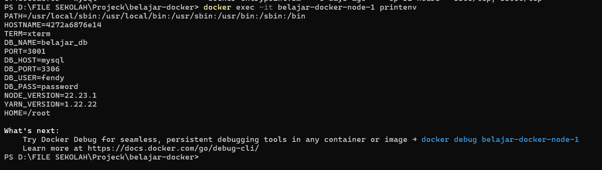

# Environment Variables

## 1. Environment Variables

Environment Variables merupakan variabel yang digunakan untuk menyimpan konfigurasi aplikasi di luar source code.

Dalam Docker, Environment Variables memungkinkan sebuah Container menerima konfigurasi saat dijalankan tanpa perlu mengubah isi Image maupun aplikasi yang ada di dalamnya.

Konfigurasi seperti nama aplikasi, username database, password database, host database, port, hingga API Key umumnya disimpan menggunakan Environment Variables.

Dengan cara ini, satu Docker Image dapat digunakan pada berbagai lingkungan, seperti Development, Staging, maupun Production, hanya dengan mengganti nilai Environment Variables yang digunakan.

## Analogi

Saat belajar, saya menganggap **Environment Variables** seperti **identitas seorang karyawan baru**.

Bayangkan sebuah perusahaan menerima karyawan baru.

Saat hari pertama bekerja, perusahaan memberikan informasi seperti:

- Nama
- Divisi
- Jabatan
- Lokasi Kerja

Informasi tersebut tidak tertulis pada tubuh karyawan, melainkan diberikan ketika ia mulai bekerja.

Begitu juga dengan Docker.

Container menerima berbagai konfigurasi saat dijalankan tanpa perlu mengubah aplikasi yang ada di dalamnya.

Dengan demikian, aplikasi yang sama dapat digunakan pada berbagai kondisi hanya dengan memberikan konfigurasi yang berbeda.

## 2. docker run -e

Docker menyediakan parameter `-e` untuk menambahkan **Environment Variable** ketika membuat sebuah Container.

Parameter ini sering digunakan untuk memberikan konfigurasi kepada aplikasi tanpa perlu mengubah source code.

Sebagai contoh, kita dapat memberikan nama aplikasi dan mode aplikasi melalui Environment Variable.

```bash
docker run -d \
--name nginx-env \
-e APP_NAME=DockerJourney \
-e APP_ENV=development \
nginx
```

### Analogi

Saat belajar, saya menganggap parameter **`-e`** seperti **mengisi formulir identitas sebelum mulai bekerja**.

Bayangkan seorang karyawan baru akan mulai bekerja di sebuah perusahaan.

Sebelum masuk ke ruang kerja, ia diminta mengisi formulir yang berisi nama, divisi, dan jabatan.

Informasi tersebut nantinya digunakan oleh perusahaan selama ia bekerja.

Begitu juga dengan Docker.

Saat Container dijalankan, kita dapat memberikan berbagai konfigurasi menggunakan parameter `-e` sehingga aplikasi dapat langsung membaca informasi tersebut.

### Penjelasan Parameter

| Parameter | Fungsi |
|-----------|--------|
| `docker run` | Membuat sekaligus menjalankan Container baru. |
| `-d` | Menjalankan Container di background (Detached Mode). |
| `--name nginx-env` | Memberikan nama `nginx-env` pada Container. |
| `-e APP_NAME=DockerJourney` | Membuat Environment Variable `APP_NAME`. |
| `-e APP_ENV=development` | Membuat Environment Variable `APP_ENV`. |
| `nginx` | Docker Image yang digunakan untuk membuat Container. |

### Logic

Saat command dijalankan, Docker akan mengecek apakah Image **nginx** sudah tersedia.

- Jika Image sudah ada, Docker langsung membuat dan menjalankan Container.
- Jika belum ada, Docker akan mengunduh Image terlebih dahulu dari Docker Hub.

Selanjutnya Docker menyimpan Environment Variable `APP_NAME` dan `APP_ENV` ke dalam Container.

Environment Variable tersebut nantinya dapat dibaca oleh aplikasi yang berjalan di dalam Container.

### Kesimpulan

- Parameter `-e` digunakan untuk membuat Environment Variable.
- Environment Variable diberikan saat Container dijalankan.
- Cara ini cocok digunakan ketika jumlah konfigurasi masih sedikit.

## 3. docker exec printenv

Setelah berhasil menambahkan Environment Variable ke dalam Container, langkah berikutnya adalah memastikan bahwa variabel tersebut benar-benar tersimpan.

Salah satu cara yang paling mudah adalah menggunakan command `printenv` melalui `docker exec`.

Command ini akan menampilkan seluruh Environment Variable yang dimiliki oleh Container.

```bash
docker exec -it nginx-env printenv
```

### Analogi

Saat belajar, saya menganggap **printenv** seperti **melihat daftar identitas seorang karyawan**.

Bayangkan seorang karyawan telah resmi bekerja di perusahaan.

Jika kita ingin mengetahui informasi yang dimilikinya, kita cukup melihat data identitas yang telah tersimpan.

Begitu juga dengan Docker.

Command `printenv` digunakan untuk melihat seluruh Environment Variable yang dimiliki oleh sebuah Container.

### Penjelasan Parameter

| Parameter | Fungsi |
|-----------|--------|
| `docker exec` | Menjalankan command di dalam Container yang sedang berjalan. |
| `-it` | Membuka mode interaktif. |
| `nginx-env` | Nama Container yang akan diperiksa. |
| `printenv` | Menampilkan seluruh Environment Variable yang ada di dalam Container. |

### Logic

Saat command dijalankan, Docker akan masuk ke dalam Container **nginx-env** kemudian menjalankan command `printenv`.

Container akan menampilkan seluruh Environment Variable yang tersedia, termasuk Environment Variable yang sebelumnya dibuat menggunakan parameter `-e`.

Melalui command ini kita dapat memastikan bahwa konfigurasi berhasil diterapkan pada Container.

### Hasil Praktik

<p align="center">
  
</p>

### Kesimpulan

- `docker exec` digunakan untuk menjalankan command di dalam Container.
- `printenv` menampilkan seluruh Environment Variable yang dimiliki Container.
- Command ini berguna untuk memastikan konfigurasi berhasil diterapkan.

## 4. File .env

Ketika jumlah Environment Variable semakin banyak, penggunaan parameter `-e` akan membuat command menjadi panjang dan sulit dibaca.

Untuk mengatasi hal tersebut, Docker dapat menggunakan file **`.env`** yang berisi kumpulan Environment Variable.

Dengan cara ini, konfigurasi menjadi lebih rapi, mudah dikelola, dan lebih praktis terutama pada project yang memiliki banyak konfigurasi.

### Analogi

Saat belajar, saya menganggap **file `.env`** seperti **lembar data karyawan**.

Bayangkan sebuah perusahaan memiliki ratusan karyawan.

Daripada memberikan formulir satu per satu setiap hari, seluruh data karyawan disimpan dalam satu berkas.

Ketika dibutuhkan, perusahaan cukup membaca berkas tersebut.

Begitu juga dengan Docker.

Daripada menulis banyak parameter `-e`, kita cukup menyimpan seluruh konfigurasi di dalam file `.env`.

### Contoh File .env

```env
APP_NAME=DockerJourney
APP_ENV=development
DB_HOST=mysql
DB_PORT=3306
DB_USER=root
DB_PASSWORD=password
```

### Logic

Docker akan membaca setiap baris pada file `.env` sebagai Environment Variable.

Masing-masing variabel akan digunakan saat Container dijalankan sehingga aplikasi dapat langsung membaca konfigurasi yang diperlukan.

### Kesimpulan

- File `.env` digunakan untuk menyimpan banyak Environment Variable.
- Membuat konfigurasi menjadi lebih rapi dan mudah dikelola.
- Sangat cocok digunakan pada project yang memiliki banyak konfigurasi.

## 5. docker run --env-file

Selain menggunakan parameter `-e`, Docker juga menyediakan parameter `--env-file` untuk membaca seluruh Environment Variable dari sebuah file.

Cara ini lebih praktis karena kita tidak perlu menuliskan banyak parameter `-e` pada command.

```bash
docker run -d \
--name nginx-env-file \
--env-file .env \
nginx
```

### Analogi

Saat belajar, saya menganggap **`--env-file`** seperti **memberikan satu map berisi seluruh dokumen kepada karyawan baru**.

Bayangkan seorang karyawan baru mulai bekerja.

Daripada menyerahkan dokumen satu per satu, perusahaan cukup memberikan satu map yang berisi seluruh informasi yang dibutuhkan.

Begitu juga dengan Docker.

Docker cukup membaca seluruh konfigurasi dari file `.env`, kemudian memberikan seluruh Environment Variable tersebut kepada Container.

### Penjelasan Parameter

| Parameter | Fungsi |
|-----------|--------|
| `docker run` | Membuat sekaligus menjalankan Container baru. |
| `-d` | Menjalankan Container di background. |
| `--name nginx-env-file` | Memberikan nama Container. |
| `--env-file .env` | Membaca seluruh Environment Variable dari file `.env`. |
| `nginx` | Docker Image yang digunakan. |

### Logic

Saat command dijalankan, Docker akan membaca isi file `.env`.

Setiap baris pada file tersebut akan dijadikan Environment Variable, kemudian diberikan kepada Container yang baru dibuat.

Cara ini lebih rapi dibandingkan menggunakan banyak parameter `-e`, terutama pada aplikasi yang memiliki banyak konfigurasi.

### Kesimpulan

- `--env-file` digunakan untuk membaca Environment Variable dari file `.env`.
- Sangat cocok digunakan pada project yang memiliki banyak konfigurasi.
- Membuat command menjadi lebih singkat dan mudah dibaca.

## 6. Praktik Environment Variables

Pada praktik ini saya mencoba menggunakan beberapa cara untuk memberikan Environment Variable kepada Docker Container.

### Langkah 1 — Membuat Container Menggunakan Parameter `-e`

```bash
docker run -d \
--name nginx-env \
-e APP_NAME=DockerJourney \
-e APP_ENV=development \
nginx
```

Container berhasil dibuat dan dijalankan menggunakan dua Environment Variable.

---

### Langkah 2 — Memastikan Environment Variable

```bash
docker exec -it nginx-env printenv
```

Docker berhasil menampilkan seluruh Environment Variable yang terdapat di dalam Container, termasuk `APP_NAME` dan `APP_ENV`.

---

### Langkah 3 — Membuat File `.env`

```env
APP_NAME=DockerJourney
APP_ENV=development
DB_HOST=mysql
DB_PORT=3306
DB_USER=root
DB_PASSWORD=password
```

File `.env` berhasil dibuat untuk menyimpan konfigurasi aplikasi.

---

### Langkah 4 — Menjalankan Container Menggunakan File `.env`

```bash
docker run -d \
--name nginx-env-file \
--env-file .env \
nginx
```

Docker berhasil membaca seluruh konfigurasi dari file `.env` kemudian menjalankan Container menggunakan konfigurasi tersebut.

---

### Workflow

```text
docker run -e
      │
      ▼
Container dibuat
      │
      ▼
docker exec printenv
      │
      ▼
Environment Variable berhasil dibaca
      │
      ▼
Membuat file .env
      │
      ▼
docker run --env-file
      │
      ▼
Container berjalan menggunakan konfigurasi dari file .env


```
## 6. Best Practice

Saat menggunakan Environment Variables, ada beberapa hal yang perlu diperhatikan.

- Hindari menyimpan password langsung di source code.
- Gunakan file `.env` apabila jumlah konfigurasi cukup banyak.
- Jangan mengunggah file `.env` yang berisi data sensitif ke GitHub.
- Untuk project open source, gunakan file `.env.example` sebagai contoh konfigurasi.

### Kesimpulan

Pada module ini saya mempelajari cara menggunakan Environment Variables untuk memberikan konfigurasi kepada Docker Container.

Saya juga mempelajari perbedaan penggunaan parameter `-e` dan `--env-file`, serta cara memastikan konfigurasi berhasil diterapkan menggunakan command `printenv`.

Penggunaan file `.env` membuat konfigurasi menjadi lebih rapi, mudah dikelola, dan lebih sesuai untuk digunakan pada project dengan banyak Environment Variable.