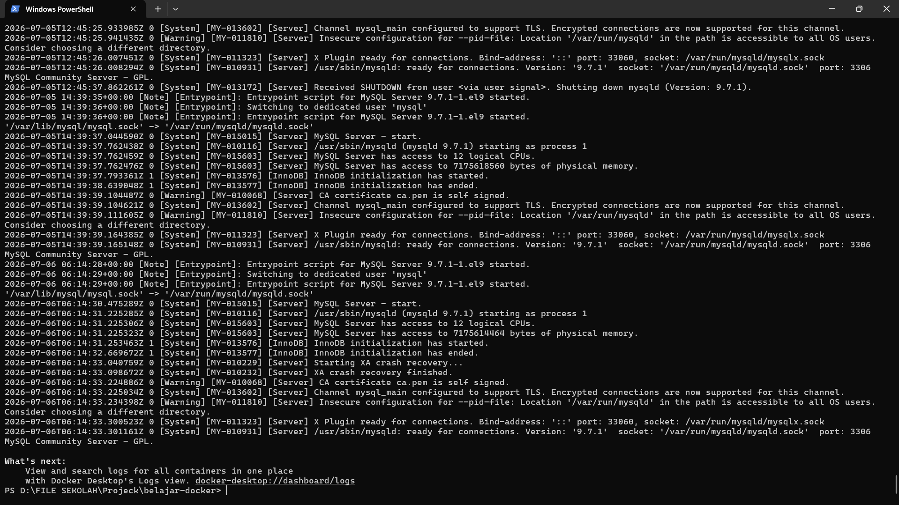
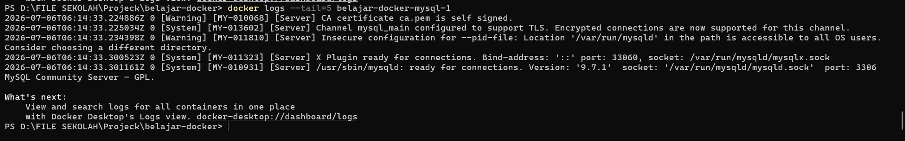

# Docker Logs

## 1. Docker Logs

Docker Logs digunakan untuk melihat seluruh output yang dihasilkan oleh aplikasi yang berjalan di dalam Container.

Output tersebut dapat berupa informasi proses aplikasi, pesan sukses, peringatan (Warning), maupun pesan kesalahan (Error).

Ketika aplikasi mengalami masalah, Docker Logs menjadi salah satu sumber informasi utama untuk melakukan proses troubleshooting.

## Analogi

Saat belajar, saya menganggap **Docker Logs** seperti **buku catatan aktivitas sebuah mesin**.

Bayangkan sebuah mesin produksi bekerja setiap hari.

Seluruh aktivitas mesin dicatat mulai dari kapan mesin dinyalakan, proses yang sedang berjalan, hingga apabila terjadi kerusakan.

Melalui catatan tersebut, teknisi dapat mengetahui apa yang sebenarnya terjadi.

Begitu juga dengan Docker.

Setiap aktivitas aplikasi akan dicatat sebagai Log sehingga memudahkan proses monitoring maupun troubleshooting.

## 2. docker logs

Command `docker logs` digunakan untuk melihat log atau output yang dihasilkan oleh sebuah Docker Container.

Log biasanya berisi informasi mengenai proses aplikasi, pesan sukses, peringatan (Warning), maupun pesan kesalahan (Error).

Command ini sangat membantu ketika aplikasi mengalami masalah karena kita dapat mengetahui apa yang sedang terjadi di dalam Container.

```bash
docker logs belajar-docker-node-1
```

### Analogi

Saat belajar, saya menganggap **docker logs** seperti **CCTV**.

Bayangkan sebuah toko memiliki kamera pengawas.

Ketika terjadi suatu masalah, kita dapat melihat rekaman CCTV untuk mengetahui apa yang sebenarnya terjadi.

Begitu juga dengan Docker.

Setiap aktivitas aplikasi dicatat sebagai Log sehingga kita dapat melihat proses yang sedang berlangsung maupun mencari penyebab suatu Error.

### Penjelasan Parameter

| Parameter | Fungsi |
|-----------|--------|
| `docker logs` | Menampilkan log dari sebuah Docker Container. |
| `belajar-docker-node-1` | Nama Container yang log-nya akan ditampilkan. |

### Logic

Saat command dijalankan, Docker akan mengambil seluruh output yang dikirim oleh proses utama (PID 1) yang berjalan di dalam Container.

Output tersebut kemudian ditampilkan pada Terminal sehingga kita dapat melihat aktivitas aplikasi, pesan informasi, maupun Error yang terjadi.

Docker tidak mengubah isi Log, melainkan hanya menampilkan output yang dihasilkan oleh aplikasi.

### Hasil Praktik
<p align="center">
  
</p>

### Kesimpulan

- `docker logs` digunakan untuk melihat log sebuah Container.
- Log membantu proses monitoring dan troubleshooting aplikasi.
- Command ini menjadi salah satu command yang paling sering digunakan ketika aplikasi mengalami Error.

## 3. docker logs -f

Secara default, command `docker logs` hanya menampilkan log yang sudah tercatat.

Jika ingin melihat log baru secara langsung ketika aplikasi sedang berjalan, Docker menyediakan parameter `-f` (**Follow**).

Parameter ini akan terus menampilkan log baru hingga proses dihentikan secara manual.

```bash
docker logs -f belajar-docker-node-1
```

### Analogi

Saat belajar, saya menganggap **docker logs -f** seperti **menonton siaran CCTV secara langsung**.

Jika `docker logs` seperti melihat rekaman CCTV, maka `docker logs -f` seperti melihat kamera CCTV secara live.

Setiap aktivitas baru akan langsung ditampilkan tanpa perlu menjalankan command kembali.

Begitu juga dengan Docker.

Selama aplikasi menghasilkan Log baru, Docker akan langsung menampilkannya pada Terminal.

### Penjelasan Parameter

| Parameter | Fungsi |
|-----------|--------|
| `docker logs` | Menampilkan log sebuah Docker Container. |
| `-f` | Menampilkan log secara real-time (Follow). |
| `belajar-docker-node-1` | Nama Container yang akan dipantau. |

### Logic

Saat command dijalankan, Docker akan menampilkan seluruh log yang sudah ada terlebih dahulu.

Setelah itu, Docker akan terus memantau Container dan langsung menampilkan setiap Log baru yang dihasilkan oleh aplikasi.

Command akan tetap berjalan hingga dihentikan menggunakan **Ctrl + C**.

### Kesimpulan

- Parameter `-f` digunakan untuk memantau Log secara real-time.
- Sangat berguna ketika melakukan proses monitoring maupun debugging aplikasi.
- Gunakan **Ctrl + C** untuk menghentikan proses pemantauan Log.

## 4. docker logs --tail

Ketika sebuah Container telah berjalan lama, jumlah log yang dihasilkan bisa sangat banyak.

Hal ini dapat menyulitkan kita dalam membaca log terbaru atau mencari informasi spesifik.

Untuk mengatasi hal tersebut, Docker menyediakan parameter `--tail` yang digunakan untuk menampilkan jumlah baris log tertentu dari akhir.

```bash
docker logs --tail=5 belajar-docker-node-1
```

### Analogi

Saat belajar, saya menganggap **parameter --tail** seperti **melihat bagian terakhir dari sebuah buku**.

Ketika kita ingin mengetahui cerita terakhir pada sebuah buku, kita cukup membuka halaman terakhir tanpa perlu membaca seluruh buku dari awal.

Begitu juga dengan Docker.

Parameter `--tail` memungkinkan kita melihat beberapa baris log terakhir tanpa harus membaca seluruh log yang ada.

### Penjelasan Parameter

| Parameter | Fungsi |
|-----------|--------|
| `docker logs` | Menampilkan log sebuah Docker Container. |
| `--tail=5` | Menampilkan 5 baris log terakhir. |
| `belajar-docker-node-1` | Nama Container yang akan dipantau. |

### Logic

Saat command dijalankan, Docker akan mengambil 5 baris log terakhir dari Container **belajar-docker-node-1**.

Log ini akan menampilkan informasi terbaru dari aplikasi yang sedang berjalan.

Penggunaan `--tail` sangat berguna ketika kita hanya ingin melihat log terbaru tanpa terganggu oleh log lama yang terlalu banyak.

### Hasil Praktik
<p align="center">
  
</p>

### Kesimpulan

- Parameter `--tail` digunakan untuk menampilkan jumlah baris log tertentu dari akhir.
- Berguna ketika ingin melihat log terbaru tanpa membaca seluruh log yang ada.
- Command ini sering dikombinasikan dengan `-f` untuk memantau log terbaru secara real-time.

## 5. Praktik Docker Logs

Pada praktik ini saya mencoba melihat Log dari sebuah Docker Container menggunakan beberapa variasi command yang telah dipelajari pada module ini.

### Langkah 1 — Melihat Seluruh Log

```bash
docker logs belajar-docker-node-1
```

Docker berhasil menampilkan seluruh Log yang dihasilkan oleh aplikasi di dalam Container.

---

### Langkah 2 — Memantau Log Secara Real-time

```bash
docker logs -f belajar-docker-node-1
```

Docker menampilkan Log secara langsung ketika aplikasi menghasilkan output baru.

Proses pemantauan dihentikan menggunakan **Ctrl + C**.

---

### Langkah 3 — Menampilkan Beberapa Log Terakhir

```bash
docker logs --tail 10 belajar-docker-node-1
```

Docker hanya menampilkan 10 baris Log terakhir sehingga output menjadi lebih ringkas dan mudah dibaca.

---

### Workflow

```text
docker logs
      │
      ▼
Melihat seluruh Log
      │
      ▼
docker logs -f
      │
      ▼
Monitoring Log secara real-time
      │
      ▼
docker logs --tail 10
      │
      ▼
Menampilkan Log terbaru
```

### Kesimpulan

Pada module ini saya mempelajari cara melihat Log yang dihasilkan oleh Docker Container menggunakan command `docker logs`.

Saya juga mempelajari penggunaan parameter `-f` untuk melakukan monitoring Log secara real-time serta parameter `--tail` untuk menampilkan beberapa Log terakhir.

Command-command tersebut sangat membantu dalam proses monitoring, debugging, dan troubleshooting aplikasi yang berjalan di dalam Docker Container.